[v1.md](https://github.com/user-attachments/files/27943587/v1.md)
# 内核 CVE 热补丁自动生成智能体：研究方向与技术路线

## 封面与题目内容页

**项目名称**：内核 CVE 热补丁自动生成智能体

**赛题名称**：内核 CVE 热补丁自动生成智能体

**所属赛事**：操作系统相关竞赛课设/赛题方向

**文档定位**：本文件是项目详细设计说明书，用于把讨论课阶段的研究路线细化为可实施、可验证、可分工的工程方案。文档重点说明从 CVE 编号到 livepatch `.ko` 产物的完整闭环，包括数据检索、patch 获取、patch 解析、目标内核适配、`kpatch-build` 构建、失败归因、自动改写、运行验证、报告生成和 MCP/HTTP 服务化接入。

## 目录

- [第1章 前言](#第1章-前言)
- [第2章 问题需求分析](#第2章-问题需求分析)
- [第3章 总体设计](#第3章-总体设计)
- [第4章 详细设计与实施步骤](#第4章-详细设计与实施步骤)
- [第5章 测试验证方案](#第5章-测试验证方案)
- [第6章 风险控制与项目推进](#第6章-风险控制与项目推进)
- [总结](#总结)
- [参考资料](#参考资料)
- [附录](#附录)

## 第1章 前言

### 1.1 题目来源

本项目来自“内核 CVE 热补丁自动生成智能体”赛题方向。赛题希望系统围绕 Linux 内核漏洞修复，完成从 CVE 编号到 livepatch 模块的自动化处理。它不是单纯的脚本拼接题，而是要求把漏洞检索、补丁理解、构建反馈和智能体决策结合起来。

当前阶段以仓库 README 中的题目说明作为正式依据。由于官方赛题页面链接和题目截图仍待补充，本文先保留题目截图占位，并在后续提交材料前统一校对 README、官方页面和本文档，保证题目来源一致。

本设计围绕一个固定目标展开：Anolis OS ANCK `6.6.102-5.2.an23.x86_64`。这意味着后续所有构建依赖、`kernel-devel`、debuginfo、source package、`vmlinux`、VM 验证环境和报告字段都必须围绕该版本组织。

智能体平台侧以 Qwen/百炼为主要大模型能力来源，通过 MCP/HTTP 服务接入本地构建与验证流程。云侧承载方案可以使用 Function Compute 自定义镜像，但它只负责服务封装和调度，不替代核心构建逻辑。

### 1.2 背景

云计算和服务器场景中的 Linux 内核安全修复通常需要同时满足三个目标：及时修复漏洞、保持业务稳定、尽量避免重启。传统内核升级往往需要维护窗口，重启和回滚都会影响在线业务；如果为了避免重启而延迟修复，漏洞暴露时间又会变长。

Linux livepatch 机制提供了另一条路径。它允许系统在运行期间替换部分内核函数实现。`kpatch-build` 则把源码 patch、对象文件差异分析和 livepatch 模块生成串联起来，使一部分内核安全修复可以通过加载 `.ko` 的方式生效。

但是，普通 upstream patch 不一定能直接变成 livepatch patch。普通 patch 面向源码树和常规内核发布流程，而 livepatch 有更严格的边界。例如初始化路径、静态分配数据、全局数据、结构体 ABI 和缺少 `fentry` 的函数，都可能触发 `kpatch-build` 限制。

因此，本项目真正要解决的问题不是简单调用命令，而是让 Agent 能够理解修复链路、识别失败原因、判断 patch 是否可安全改写，并把全部证据保存下来。只有这样，系统输出的成功或失败结论才有工程可信度。

### 1.3 研究目的

本项目的直接目标是实现从 CVE 编号到 livepatch 产物的自动化闭环。系统输入 CVE 列表和目标内核版本，输出每个 CVE 的原始 patch、改写 patch、构建日志、失败归因、验证日志、`.ko` 产物和 `report.json`。

这个目标可以进一步拆成五层。

1. 检索自动化：系统从 CVE 编号出发，查询 NVD、Linux CVE announce、Linux stable 等来源，定位候选修复 commit，并记录证据和置信度。
2. patch 结构化：系统不能只把 patch 当作文本文件，而要解析受影响文件、hunk、函数、增删行、上下文和 kpatch 风险标签，形成 `patch_ir.json`。
3. 构建闭环：系统在固定环境中调用 `kpatch-build`，并把成功产物或失败日志保存下来。失败不能只看最后一行，而要归因到具体阶段。
4. 自动改写：系统采用规则优先、LLM 辅助的方式。确定性问题由规则处理，复杂日志解释和候选改写方案由 Qwen/百炼辅助。
5. 运行验证与报告：系统在 Anolis OS 23.4 VM 上验证 `.ko` 的加载、状态、卸载和必要的最小回归结果，并把结论写入结构化报告。

### 1.4 术语说明

本文中的 CVE 指公开漏洞编号，是系统的原始输入。NVD 是漏洞元数据库，用于获取描述、影响版本和参考链接。Linux CVE announce 是 Linux 漏洞公告邮件列表，用于追踪 CVE 公告和修复线索。Linux stable 是 stable 分支仓库，用于获取进入维护分支的修复 commit。

patch 是源码差异文件，是后续解析、适配、改写和构建的核心对象。backport 指把上游修改适配到目标源码树，常用于处理目标 ANCK 内核与 upstream stable 上下文不一致的问题。

livepatch 是 Linux 内核运行时热补丁机制，`kpatch-build` 是生成 livepatch 模块的核心工具。`fentry` 是函数入口插桩机制，它决定部分函数是否具备可 hook 条件。

MCP 在本文中指给百炼 Agent 暴露工具能力的模型上下文协议。Function Compute 指云侧自定义镜像承载方案，用于封装 MCP/HTTP 服务入口或任务调度层。

## 第2章 问题需求分析

### 2.1 输入输出分析

赛题输入不是已经准备好的 patch，而是 CVE 编号集合。系统首先读取 `cves.txt`，对每行 CVE 编号做格式校验和去重，然后为每个 CVE 创建独立工作目录。

目标内核版本默认固定为 `6.6.102-5.2.an23.x86_64`。如果 CLI 显式传入其他版本，也必须在 `run_config.json` 和 `report.json` 中记录，避免构建环境和报告口径不一致。

系统输出分为中间证据和最终产物两类。中间证据用于解释系统每一步为什么这样做，最终产物用于评测、验证和答辩展示。

中间证据包括：

- `metadata/cve_metadata.json`
- `metadata/candidate_commits.json`
- `patches/original.patch`
- `patch_ir.json`
- `context_match.json`
- `logs/build_N.log`
- `failure.json`
- `attempt_N.json`

这些中间文件不是附属材料，而是 Agent 决策的依据。例如 `candidate_commits.json` 用于说明为什么选择某个修复提交，`patch_ir.json` 用于说明 patch 修改了哪些文件和函数，`failure.json` 用于说明为什么进入改写或人工介入。

最终产物包括：

- `artifacts/livepatch.ko`
- `verification.json`
- 单 CVE 的 `report.json`
- 批任务的 `summary.json`

如果构建失败，系统仍然要输出 `report.json`。报告要说明最终状态、失败类别、失败证据和下一步人工排查建议，不能只留下一个失败返回码。

从用户角度看，最终输出应能直接支持三种问题：

1. 如果成功，用户要知道 `.ko` 在哪里、如何验证过、目标内核是否匹配。
2. 如果失败，用户要知道失败发生在哪一步、是否还能自动修复、为什么需要人工处理。
3. 如果跳过，用户要知道是输入无效、目标源码已修复，还是候选证据不足。

### 2.2 功能需求

功能需求按处理链路展开。这里保留编号，是为了让后续实现时可以直接拆任务。

1. CVE 列表读取。系统要支持逐行读取、忽略空行、检测非法编号、记录重复项，并为每个有效 CVE 创建独立目录。
2. CVE 检索。系统需要查询 NVD、Linux CVE announce 和 Linux stable。每个候选 commit 都要记录来源、标题、分支、commit id、候选评分和选择原因。
3. patch 获取。系统优先从 Linux stable commit 下载 patch；如果 stable commit 不明确，则尝试从邮件列表或本地 git 仓库生成 patch。
4. patch 解析。系统要从 diff 中提取受影响文件、hunk、增删行、上下文、受影响函数和风险标签，并判断目标源码状态。
5. 构建执行。系统调用 `kpatch-build`，捕获 stdout、stderr、返回码和产物路径。成功时保存 `.ko`、哈希和 `modinfo`；失败时保存完整日志。
6. 失败归因和自动改写。失败类别至少包括 `patch_apply`、`compile`、`kpatch_limit`、`env_missing` 和 `verify`。规则库先判断是否可自动处理，规则不足时再请求 Qwen/百炼辅助。
7. 运行验证。成功生成 `.ko` 后，系统要在 Anolis OS 23.4 VM 上确认 `uname -r` 匹配目标内核，然后执行加载、状态检查、最小功能验证或回归验证、卸载和 `dmesg` 收集。
8. 服务化接入。CLI 闭环稳定后，再封装 MCP/HTTP 接口，包括 `submit_task`、`get_status`、`get_report` 和 `get_artifact`。

### 2.3 非功能需求

系统必须可复现。相同 CVE、相同 patch、相同目标内核、相同构建镜像和相同工具版本，应得到一致结论。为此，报告中必须记录 Fedora x86_64 开发环境、Anolis OS 23.4 container、Anolis OS 23.4 VM、目标内核包版本、`kpatch-build` 版本和关键路径。

系统必须可追溯。不能只保存最终 `.ko`，还要保存每轮 patch、每轮日志、失败归因、改写原因、来源链接和状态转换。这样做是为了答辩时能够解释“为什么选这个 patch”“为什么改写”“为什么失败”“为什么判定不可热补丁化”。

系统必须可解释。失败不是异常终止，而是一种正式输出。`kpatch-build` 失败、环境缺失、验证失败或语义无法确认时，都应形成结构化结论。

系统必须安全。报告、日志和提示词中不写入真实凭证、私密连接材料或敏感配置。MCP/HTTP 服务只接受白名单参数，不允许通过 Agent 执行任意 shell 命令。

系统必须具备批处理隔离能力。每个 CVE 有独立状态机和独立工作目录，单个 CVE 失败不影响其他 CVE。

批处理隔离还要求日志和产物命名不能依赖全局临时文件。每个 CVE 的 patch、日志、`.ko`、状态文件都必须放在自己的目录下。这样即使两个 CVE 同时构建，也不会互相覆盖 `build.log` 或 `livepatch.ko`。

### 2.4 约束边界

目标内核固定为 Anolis OS ANCK `6.6.102-5.2.an23.x86_64`。这不是一个普通字符串，而是贯穿源码、devel 包、debuginfo、`vmlinux`、VM 启动内核和报告字段的基准。

自动改写必须保持修复语义。如果为了构建成功而删除安全检查、改变漏洞修复逻辑或绕过关键路径，系统应判定失败，而不是生成看似成功但不可信的产物。

默认每个 CVE 最多 5 轮自动尝试。达到上限后应输出失败类别、证据和人工排查建议，不能无限循环。

并非所有 CVE 都适合 livepatch。涉及结构体 ABI、大范围全局数据、初始化路径或无法 hook 函数时，系统可以输出“不可热补丁化”或 `manual_required`。

讨论课阶段优先完成本地 CLI 闭环。MCP/HTTP、百炼和 Function Compute 是后续封装层，不应阻塞核心构建与验证能力。

### 2.5 验收指标

验收指标不只看最终是否生成 `.ko`，而是看每个阶段是否有证据、有解释、有复现方法。

1. 检索阶段要求来源可追溯。每个 CVE 至少要记录可信来源；如果没有找到足够证据，也必须明确写入报告。
2. patch 阶段要求原始 patch 和改写 patch 可审计。`original.patch` 不覆盖，`attempt_N.patch` 每轮独立保存。
3. 构建阶段要求成功可复现、失败可解释。成功时 `.ko` 存在并记录哈希；失败时 `failure.json` 能说明阶段、信号、位置和下一步动作。
4. 验证阶段要求加载和卸载证据完整。系统至少要记录目标 VM 的 `uname -r`、加载返回码、livepatch 状态、卸载返回码和关键 `dmesg`。
5. 报告阶段要求 `report.json` 能直接回答：最终成功还是失败、依据是什么、产物在哪里、如何复现。

验收时不应只选择成功样例。至少要准备一个成功样例、一个 patch apply 失败样例、一个编译失败样例、一个 kpatch 限制样例和一个验证失败样例。这样才能证明系统不只是“成功路径可跑”，而是失败路径也能解释清楚。

## 第3章 总体设计

### 3.1 设计原则

本系统遵循五条原则。这里使用编号，是为了明确设计取舍。

1. 规则优先，LLM 辅助。确定性错误模式由规则处理，复杂日志解释和候选改写由 Qwen/百炼辅助。LLM 不直接决定最终产物，所有建议都必须落到 patch diff、构建日志和验证证据上。
2. 先闭环后智能。先打通本地 CLI，从 CVE 到报告形成可复现流程，再接入 MCP/HTTP、百炼 Agent 和 Function Compute。
3. 证据落盘。所有关键决策都写入 `state.json`、`attempt_N.json` 或 `report.json`。终端输出只用于观察，不作为唯一证据。
4. 失败是有效结果。不可热补丁化、检索证据不足、环境缺失和语义无法确认都应被清晰报告。
5. 每个 CVE 独立执行。工作目录、状态机、日志、产物和重试次数互相隔离，便于批处理和复盘。

### 3.2 系统整体架构图

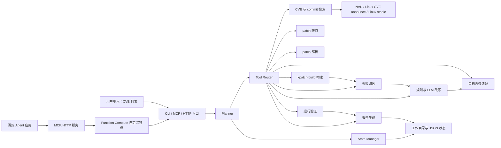

这张图展示的是系统的最高层职责划分：用户或百炼应用只进入统一入口，真正的 CVE 检索、patch 处理、构建、归因、改写和验证都由 Agent 编排层调度。图中的关键闭环是“构建失败进入失败归因，失败归因再驱动改写”，这说明系统不是一次性构建脚本，而是带反馈的多轮修复流程。

### 3.3 Agent 内部架构

Agent 层不是单一大模型调用，而是一组分工明确的组件。每个组件只负责自己的边界，避免让 LLM 同时承担检索、执行、判断和报告全部职责。

Planner 负责判断每个 CVE 当前处于哪个阶段，以及下一步应该做什么。它读取 `state.json`、上一轮 `attempt_N.json`、`failure.json` 和验证结果，再决定继续构建、改写、验证、失败收敛或人工介入。

Planner 的判断不能只依赖字符串状态。它还要读取最近一次 attempt 的返回码、失败类别、是否超过 5 轮、当前 patch 是否通过 dry-run、是否已经生成 `.ko`、验证是否完成。这样可以避免出现“构建失败却进入验证”或“已达到重试上限仍继续改写”的错误流程。

Tool Router 负责工具调用。它封装 NVD 查询、Linux CVE announce 检索、Linux stable 搜索、patch 下载、diff 解析、源码上下文检索、`kpatch-build` 执行、日志分类、LLM 改写建议和 VM 验证等能力。

Tool Router 的接口应尽量统一。每个工具返回三类信息：是否成功、产物路径、错误摘要。真正的大日志不直接塞进内存状态，而是写入工作目录，再把路径交给 State Manager 和 Reporter。

State Manager 负责状态落盘。每次状态转换都记录时间、原因、输入、输出和证据路径，保证系统中断后可以继续分析。

`state.json` 建议保持小而稳定，记录当前阶段、当前 attempt、最终状态、最后一次错误摘要和关键产物路径。详细日志放在 `logs/`，详细尝试记录放在 `attempt_N.json`，避免状态文件无限膨胀。

Evidence Collector 负责收集证据。它把来源链接、原始响应、patch、diff、日志、哈希、`dmesg` 和验证命令返回码整理到工作目录。

Rewrite Advisor 负责改写建议。它先查规则库，如果规则无法处理，再把必要的 patch 片段、错误片段和目标源码上下文交给 Qwen/百炼解释。它的输出不是自然语言结论，而是可审计的 `rewrite_plan.json` 和候选 patch。

Verifier 负责运行验证。它在目标 VM 中确认内核版本、加载 `.ko`、检查 livepatch 状态、执行最小功能验证或回归验证，并卸载模块。

Reporter 负责把所有阶段结果汇总为 `report.json` 和 `summary.json`。

Reporter 不应重新推断业务结论，而应汇总前面模块已经落盘的事实。换句话说，是否成功由状态机和验证结果决定，Reporter 只负责把证据组织成评审和用户都能读懂的格式。

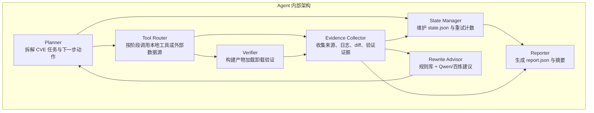

这张图说明 Agent 内部不是一个单独的 LLM，而是由多个可替换模块组成。Planner 决定下一步，Tool Router 执行工具，Evidence Collector 和 State Manager 负责把证据与状态落盘，Rewrite Advisor 只在需要改写时介入，Reporter 最后汇总事实。因此，LLM 的位置被限制在建议和解释环节，不能绕过工具验证直接改变最终结论。

### 3.4 Agent 工具编排

工具编排采用“Planner 决策、Tool Router 执行、State Manager 落盘”的方式。每个工具只负责一个可验证动作，工具之间不直接互相调用。所有中间结果先写入工作目录，再由 Planner 根据状态和证据决定下一步。

工具不应暴露为一个通用 shell 入口，而应设计成受控的类型化工具。每个工具都要声明输入字段、输出字段、产物路径、可能失败类型和是否允许重试。这样做可以把“模型想做什么”和“系统实际允许做什么”分开，降低误执行风险，也便于后续接入 MCP/HTTP。

从职责上看，Agent 工具建议分为七类。

1. 检索类工具负责从外部来源定位漏洞和修复证据。它们包括 NVD 查询、Linux CVE announce 检索、Linux stable 搜索和候选 commit 评分，输出 `raw_nvd.json`、`announce_links.json`、`candidate_commits.json`。
2. patch 类工具负责获取和解析补丁。它们包括 patch 下载、邮件 patch 提取、unified diff 解析、patch dry-run，输出 `original.patch`、`patch_ir.json` 和 `context_match.json`。
3. 源码索引类工具负责理解目标 ANCK 源码。它们包括文件索引、函数索引、符号索引、ctags 查询、调用关系粗略分析，输出函数位置、上下文片段和 symbol metadata。
4. 构建类工具负责准备环境并调用 `kpatch-build`。它们包括环境检查、构建执行、产物收集和 `modinfo` 读取，输出 `build_N.log`、`.ko`、哈希和环境记录。
5. 失败归因类工具负责把日志转成结构化错因。它们包括 build 日志分类、verify 日志分类、错误片段抽取和规则命中，输出 `failure.json`。
6. 改写类工具负责生成候选修复适配方案。它们包括规则改写、RAG 上下文检索、Qwen/百炼建议、语义审计和 diff 校验，输出 `rewrite_plan.json` 和 `attempt_N.patch`。
7. 验证与报告类工具负责运行时验证和最终交付。它们包括 VM 传输、加载、状态检查、卸载、`dmesg` 收集、报告汇总，输出 `verification.json`、`report.json` 和 `summary.json`。

工具调用还需要统一超时和重试策略。网络检索类工具可以短重试；`kpatch-build` 这类长任务不应盲目重试，必须先分类失败原因；VM 验证如果因为连接异常失败，可以重试一次，但如果 `dmesg` 明确显示模块错误，就应进入验证失败归因。

每次工具调用建议统一记录为 `tool_result`。该结构不是最终报告，而是 Agent 内部审计记录，便于恢复和排查。

```json
{
  "tool_name": "run_kpatch_build",
  "stage": "build",
  "attempt_index": 2,
  "input_paths": ["patches/attempt_2.patch", "patch_ir.json"],
  "output_paths": ["logs/build_2.log"],
  "return_code": 1,
  "status": "failed",
  "error_type": "compile",
  "summary": "目标内核中函数签名与上游 patch 不一致",
  "retryable": true,
  "started_at": "2026-05-07T10:20:00+08:00",
  "finished_at": "2026-05-07T10:24:30+08:00"
}
```

这类记录可以放入 `events.jsonl` 或每轮 `attempt_N.json`。后续 Reporter 只需要读取结构化结果和证据路径，不需要重新解析终端输出。

#### 3.4.1 Tool 的具体清单

Agent 工具不应设计成一个“万能执行命令”入口。更合理的方式是把工具拆细，让每个工具有明确输入、明确输出和明确失败类型。这样 Planner 才能基于结构化结果继续决策，而不是依赖大模型猜测命令执行结果。

1. 第一类是 CVE 与资料检索工具。`query_nvd(cve_id)` 查询 NVD 原始数据，输出漏洞描述、CVSS、影响版本和参考链接。`search_linux_cve_announce(cve_id)` 查询 Linux CVE 公告邮件，输出邮件主题、message id、相关 patch 链接和修复线索。`search_linux_stable(query)` 在 stable 仓库中按 CVE、标题、文件名和函数名搜索候选 commit。`score_candidate_commits(cve_id, candidates)` 根据来源命中、文件命中、版本邻近和邮件引用给候选 commit 打分。

2. 第二类是 patch 工具。`fetch_patch(commit_or_url)` 下载或生成 `original.patch`。`parse_unified_diff(patch_path)` 解析 diff，生成文件列表、hunk、增删行和初步函数范围。`inspect_target_source(patch_ir, source_tree)` 在目标源码树中定位上下文，判断是否已经修复、部分修复或需要 backport。`check_patch_apply(patch_path, source_tree)` 只做 dry-run，不修改源码树，用于判断 patch 是否可应用。
3. 第三类是构建工具。`prepare_build_env(kernel_version)` 检查 source、kernel-devel、debuginfo 和 `vmlinux` 是否齐全。`run_kpatch_build(patch_path, source_tree, vmlinux)` 执行构建并保存完整日志。`collect_build_artifact(build_dir)` 在成功时收集 `.ko`、哈希、大小和 `modinfo`。这类工具要限制可执行参数，不能让 Agent 任意拼 shell。
4. 第四类是日志和失败归因工具。`classify_build_log(log_path)` 从 `build_N.log` 中提取失败阶段、错误信号、文件、函数、符号和 section。`classify_verify_log(log_path, dmesg_path)` 负责运行验证失败分类。`summarize_failure(failure_json)` 把结构化失败转为可读说明，供报告和百炼对话使用。
5. 第五类是改写工具。`retrieve_context_for_rewrite(patch_ir, failure_json)` 为改写准备最小上下文。`propose_rewrite_with_rules(context)` 尝试规则改写。`propose_rewrite_with_llm(context)` 在规则不足时调用 Qwen/百炼给候选建议。`validate_rewrite(original_patch, new_patch, patch_ir)` 检查改写是否保留关键修复语义，并生成 `rewrite_plan.json`。
6. 第六类是验证工具。`transfer_artifact_to_vm(ko_path)` 把 `.ko` 传入 Anolis OS 23.4 VM 并校验哈希。`load_livepatch(ko_path)` 执行加载。`check_livepatch_state()` 查询 livepatch 状态。`run_minimal_regression(cve_id)` 对可构造用例执行最小验证。`unload_livepatch(module)` 执行卸载。`collect_dmesg()` 保存关键内核日志。
7. 第七类是索引与记忆工具。`build_source_index(source_tree)` 生成文件、函数、符号索引。`upsert_rag_chunk(chunk)` 把 chunk 写入 RAG 数据库。`retrieve_similar_cases(failure_json)` 检索相似失败案例。`promote_case_to_memory(report_json)` 只在验证通过或人工确认后，把案例沉淀为长期经验。

工具的粒度要保持适中。过粗的工具会让 Planner 无法判断中间状态，过细的工具又会导致编排复杂。建议以“能独立验证一个阶段性事实”为拆分标准，例如“下载 patch”和“解析 patch”应拆开，“解析 patch”和“判断目标源码是否已修复”也应拆开。

#### 3.4.2 RAG 的设计

RAG 在本项目里不是为了让模型“多知道一点背景”，而是为了给每次决策提供可引用证据。Agent 需要检索的知识分为三类：外部漏洞知识、内核源码知识和项目运行知识。

外部漏洞知识包括 NVD、Linux CVE announce、Linux stable commit、邮件列表 patch 和上游文档。它们用于回答“这个 CVE 的修复在哪里”“哪个 commit 最可信”“修复是否进入 stable 分支”。这类资料应保存原始响应，同时抽取标题、链接、commit id、文件名、函数名和时间信息。

内核源码知识来自目标 ANCK 源码树。它用于回答“目标内核里有没有这个函数”“上下文是否一致”“是否已有部分修复”“有没有替代 helper”。这类 RAG 不一定需要复杂向量库，第一阶段可以用 `rg`、ctags、函数索引和路径索引实现。对内核代码来说，精确符号检索通常比泛语义检索更可靠。

项目运行知识来自工作目录。它包括过往 CVE 的失败归因、已验证的改写策略、成功样例、失败样例和环境记录。它用于回答“这种 kpatch 错误以前怎么处理”“这个目标内核里类似 API 差异是否出现过”。这部分可以先用 JSON 文件和规则库保存，后续再做向量检索。

RAG 数据库建议采用“结构化索引 + 向量索引 + 原文证据”的三层设计。结构化索引用 JSON 或轻量数据库保存 CVE ID、commit id、文件路径、函数名、错误类别等确定字段；向量索引用于保存漏洞描述、邮件正文、commit message、失败摘要和人工处理记录；原文证据始终保存在 `metadata/`、`patches/`、`logs/` 或 `knowledge/` 目录中。

第一阶段可以不依赖重量级数据库。对课程项目而言，`knowledge/index/*.jsonl` 加本地 embedding 文件已经能表达设计思路，也能在实现上保持可控。后续如果需要服务化并发检索，再替换成 SQLite、PostgreSQL 扩展或专用向量库。关键不是选型名称，而是每条召回结果都必须能回到 evidence path。

一个 RAG chunk 至少应保存正文、metadata、来源路径和可信度。示例如下：

```json
{
  "chunk_id": "log:CVE-2026-0001:build_2:compile:001",
  "source_type": "log",
  "text": "error: too few arguments to function example_check",
  "metadata": {
    "cve_id": "CVE-2026-0001",
    "kernel_version": "6.6.102-5.2.an23.x86_64",
    "stage": "build",
    "failure_category": "compile",
    "file_path": "net/example.c",
    "function_name": "example_check",
    "attempt_index": 2
  },
  "evidence_path": "logs/build_2.log",
  "confidence": 0.86
}
```

这个结构的重点是 metadata。向量相似度只能说明“文本相似”，metadata 才能说明“是否属于同一 CVE、同一内核版本、同一文件、同一函数、同一错误类别”。Planner 在使用 RAG 结果时，应先用 metadata 过滤，再把少量高置信证据交给 LLM。

RAG 的基本流程可以设计为四步：

1. Query 构造。Planner 根据当前阶段构造检索问题，例如“CVE 对应 stable commit”“目标源码中函数上下文”“kpatch 错误模式”。
2. Retrieve 检索。Tool Router 调用 NVD、邮件列表、git、源码索引、日志索引等工具返回候选证据。
3. Rerank 排序。系统按来源可信度、关键字命中、路径匹配、版本邻近和时间顺序排序。
4. Grounded answer 生成。LLM 只能基于检索到的证据解释或建议，回答中必须引用 evidence id 或文件路径。

为了避免 RAG 引入噪声，检索上下文要尽量短。比如给 LLM 做 patch 改写时，不应传完整源码文件，而应传受影响函数、相邻调用、错误片段、原始 hunk 和目标源码 hunk。上下文太大时，模型更容易忽略关键约束。

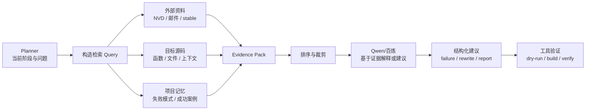

这张图描述了 RAG 的实际执行方式：Planner 先把当前问题转成检索 query，再从外部资料、目标源码和项目记忆中取回证据。证据经过排序和裁剪后才交给 Qwen/百炼，模型输出的建议还必须经过 dry-run、build 或 verify 等工具验证，验证通过后才能影响状态机。

#### 3.4.3 记忆设计

Agent 的记忆要分层，不能把所有历史都塞进 prompt。建议分为短期记忆、任务记忆、长期经验记忆和环境记忆。

短期记忆只服务当前一步决策，主要存在于本轮 Planner 输入中。它包括当前 CVE、当前状态、当前 attempt、最近一次失败、下一步候选动作。这部分可以由 `state.json` 和最近的 `attempt_N.json` 组合得到。

任务记忆服务单个 CVE 的完整流程，落在 CVE 工作目录里。它包括 `metadata/`、`patches/`、`logs/`、`patch_ir.json`、`failure.json`、`verification.json` 和 `report.json`。当任务中断或恢复时，Agent 通过这些文件恢复上下文，而不是依赖对话历史。

长期经验记忆服务多个 CVE。它可以保存为规则库和案例库，例如 `rules/failure_patterns.yaml`、`rules/rewrite_strategies.yaml`、`examples/success_cases/`、`examples/failure_cases/`。长期记忆的内容必须来自已经验证的结果，不能直接把 LLM 的猜测写进去。

环境记忆记录构建和验证环境。它包括目标内核版本、容器镜像 digest、kernel-devel 路径、debuginfo 路径、`vmlinux` 路径、VM 的 `uname -r` 和工具版本。环境记忆用于判断失败是否可能来自版本不一致。

记忆写入要有门槛。构建成功并验证通过的改写策略可以进入长期经验记忆；明确归因的失败样例可以进入失败模式库；未验证的 LLM 建议只能保存在当前 attempt 中，不能沉淀为规则。

长期记忆建议分成三类维护。

1. 失败模式记忆。记录错误关键词、失败阶段、典型日志片段、处理建议和是否可自动重试。例如 `hunk failed` 通常进入 backport，缺少 `vmlinux` 进入环境修复，结构体布局变化进入人工介入。
2. 改写策略记忆。只保存验证过的策略。例如“目标内核 API 参数少一个 flag 时如何兼容”“某类 helper 在 ANCK 中的替代函数是什么”。没有验证通过的建议不能进入这类记忆。
3. 环境与案例记忆。保存成功 CVE、失败 CVE、目标内核包版本、构建镜像和 VM 信息。这类记忆用于复现实验，也用于答辩说明系统不是只跑单个样例。

记忆读取也要有限制。当前 CVE 的 task memory 优先级最高，其次是目标内核环境记忆，再其次是相似失败案例。长期经验记忆只能作为建议来源，不能覆盖当前日志和当前源码事实。

#### 3.4.4 Agent 决策策略

Agent 决策采用“规则 gate + LLM suggestion + 工具验证”的模式。规则 gate 先判断是否允许进入下一步，LLM 只提供建议，工具验证决定建议是否成立。

例如 patch apply 失败时，规则 gate 允许进入上下文检索和 backport。LLM 可以解释 hunk 应该如何迁移，但最终必须通过 `git apply --check`。如果 dry-run 不通过，不能进入构建。

再例如 kpatch 限制失败时，规则 gate 先判断风险标签。如果涉及结构体 ABI 或初始化路径，默认进入人工介入；如果只是上下文或 API 差异，才允许进入自动改写。LLM 可以提出替代 hook 点，但必须能在目标源码中检索到该函数，并且 patch IR 要能说明修复语义仍然保留。

每次决策都应写入 `decision` 字段，至少包含四项内容：当前事实、候选动作、选择理由、下一步验证方式。这样报告里可以解释 Agent 为什么继续、为什么停止、为什么请求人工介入。

#### 3.4.5 Prompt 与上下文约束

LLM prompt 应该采用固定模板，而不是每个模块临时拼接。模板中需要明确角色、输入、禁止事项、输出 JSON 格式和验证要求。

本项目的 prompt 不直接喂完整 patch 和完整日志，而是优先喂“修改信息摘要”。修改信息由工具从 patch 和目标源码中抽取，至少包含受影响文件、函数、增删逻辑、风险标签、目标源码匹配状态和构建错误位置。这样可以减少上下文噪声，也能让模型围绕真实证据做判断。

失败解释 prompt 模板如下：

```text
你是 Linux 内核 livepatch 构建失败分析助手。请只基于输入证据分析，不要编造不存在的函数、commit 或源码。

任务：
分析本次 kpatch-build 失败原因，输出机器可读 JSON。

输入：
- cve_id: {{cve_id}}
- target_kernel: {{kernel_version}}
- attempt_index: {{attempt_index}}
- patch_change_summary: {{change_summary_json}}
- patch_risk_tags: {{risk_tags}}
- target_context_status: {{target_status}}
- build_log_excerpt: {{build_log_excerpt}}
- known_failure_patterns: {{matched_patterns}}

禁止事项：
- 不得声称某个函数存在，除非 target_context 中已经给出。
- 不得建议删除安全检查、跳过错误返回或绕过漏洞修复逻辑。
- 不得把环境缺失解释成源码问题。
- 不得输出自然语言散文，只能输出 JSON。

输出 JSON schema：
{
  "stage": "apply|build|verify|resolve|unknown",
  "category": "patch_apply|compile|kpatch_limit|env_missing|verify|unknown",
  "reason_code": "string",
  "evidence": [
    {
      "source": "logs/build_1.log",
      "signal": "string",
      "line_hint": "string"
    }
  ],
  "affected_change": {
    "file": "string",
    "function": "string",
    "change_id": "string"
  },
  "retryable": true,
  "recommended_action": "rewrite|manual_required|fix_environment|stop",
  "rewrite_constraints": [
    "必须保留原始安全检查语义"
  ]
}
```

patch 改写 prompt 更严格，只允许输出改写计划，不允许直接输出未经验证的最终结论：

```text
你是 Linux 内核 patch backport 助手。请根据原始修改信息、目标源码上下文和失败原因，提出最小改写计划。

目标：
让 patch 适配目标内核，同时保持 CVE 修复语义不变。

输入：
- cve_id: {{cve_id}}
- target_kernel: {{kernel_version}}
- original_fix_intent: {{fix_intent}}
- change_units: {{change_units_json}}
- failed_change_unit: {{failed_change_unit_json}}
- target_source_context: {{target_context_excerpt}}
- failure_json: {{failure_json}}

硬性约束：
- 只能改写当前 failed_change_unit 相关逻辑。
- 必须保留新增边界检查、权限检查、长度检查、引用计数处理和错误返回路径。
- 如果修复依赖结构体布局变化、全局状态新增、初始化路径或无法确认的生命周期语义，必须输出 manual_required。
- 不得发明目标源码中不存在的 API、字段、宏或函数。
- 输出不直接作为最终 patch，后续必须由工具生成 diff 并执行 git apply --check 和 kpatch-build。

输出 JSON schema：
{
  "decision": "rewrite|manual_required|stop",
  "reason": "string",
  "rewrite_scope": {
    "file": "string",
    "function": "string",
    "change_id": "string"
  },
  "semantic_must_keep": [
    "string"
  ],
  "proposed_steps": [
    {
      "operation": "move_hunk|adapt_api|add_include|adjust_macro|rewrite_to_caller|other",
      "target_location": "string",
      "description": "string"
    }
  ],
  "validation_plan": [
    "git apply --check",
    "kpatch-build",
    "VM load/unload"
  ],
  "manual_required_reason": null
}
```

报告摘要 prompt 则可以更偏自然语言。它应把结构化结果转成用户能读懂的摘要，但不能改写状态结论。例如 `manual_required` 不能被润色成“基本成功”，`verify` 失败不能被描述为“已完成修复”。

#### 3.4.6 防幻觉与安全边界

Agent 最容易出错的地方，是把 LLM 的解释当成事实。为避免这一点，系统应规定：凡是涉及 commit、文件、函数、日志、产物、验证结果的结论，都必须能指向本地文件或外部来源链接。

如果 LLM 提到某个函数存在，Tool Router 必须在目标源码中检索确认。如果 LLM 说某个 commit 修复了 CVE，Evidence Collector 必须能找到 commit message、邮件引用或 NVD 参考链接。如果 LLM 建议修改 patch，Rewrite Advisor 必须生成 diff，并通过格式检查和 dry-run。

安全边界也要清楚。Agent 不能暴露任意 shell 工具给模型，不能把凭证写入 prompt，不能允许模型决定删除工作目录、修改系统配置或跳过验证。服务化后，MCP/HTTP 接口也只能开放白名单工具。

### 3.5 核心流水线

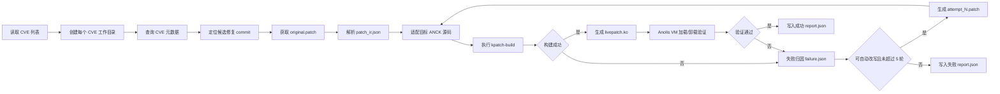

这张图展示单个 CVE 的主流水线。流程先从 CVE 检索和 patch 获取开始，经过 patch IR、目标内核适配和 `kpatch-build`。如果构建失败，就进入失败归因和改写循环；如果构建成功，则进入 VM 验证。最终无论成功、失败还是人工介入，都要写入 `report.json`。

### 3.6 单 CVE 状态机

每个 CVE 独立维护状态。状态机记录在 `state.json` 中，所有状态转换都要带 `timestamp`、`reason` 和 evidence 路径。这样做不是为了让流程复杂化，而是为了保证批处理时每个 CVE 的失败和成功都能单独复盘。

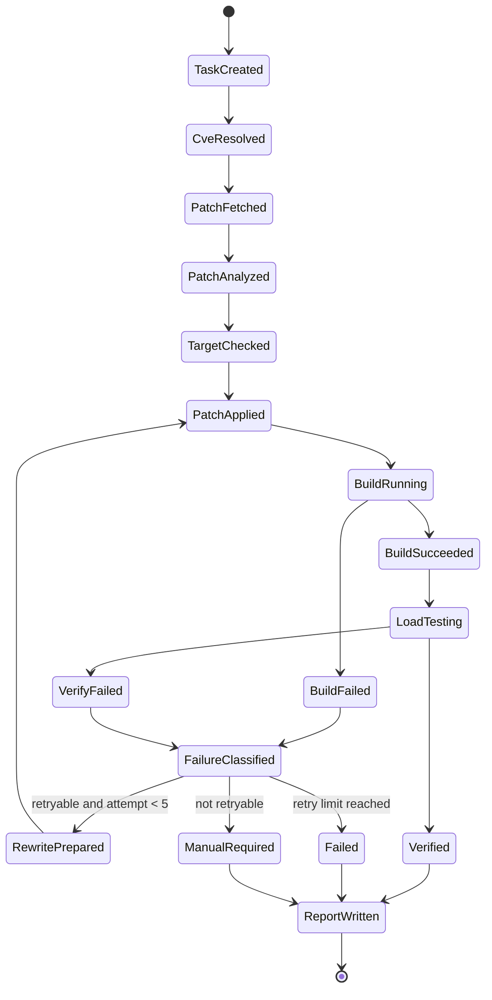

这张状态机图强调每个 CVE 都有独立生命周期。正常路径会从任务创建走到构建成功和验证通过；失败路径会先进入归因，再根据是否可重试决定改写、失败或人工介入。这样设计可以让批处理中的每个 CVE 都有可追踪状态，而不是被一次命令返回码笼统覆盖。

### 3.7 数据流设计

数据流以工作目录为中心。`cves.txt` 先生成 `run_config.json` 和每个 CVE 的 `state.json`。检索阶段写入 `metadata/`，patch 阶段写入 `patches/` 和 `patch_ir.json`，构建阶段写入 `logs/` 和 `artifacts/`，验证阶段写入 `verification.json`，最后由 Reporter 汇总为 `report.json` 和 `summary.json`。

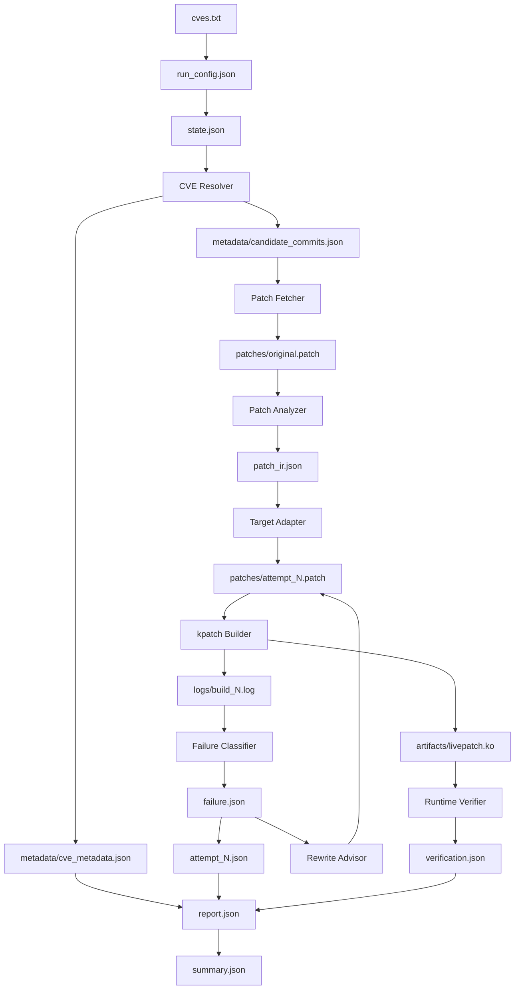

这张图说明数据不是只在内存中流转，而是持续写入工作目录。检索结果、原始 patch、patch IR、构建日志、失败归因、验证结果和最终报告都有明确文件路径。这样做的目的，是让 Agent 中断后可以恢复，也让答辩或评测时能够逐项检查证据。

### 3.8 patch 解析数据流图

patch 解析先读取 `original.patch`，提取 `diff --git` 文件头，再解析每个 hunk 的旧行号、新行号、上下文行、删除行和新增行。随后系统结合 hunk header、目标源码上下文或 ctags 信息定位受影响函数，最后为函数和文件标注风险标签。

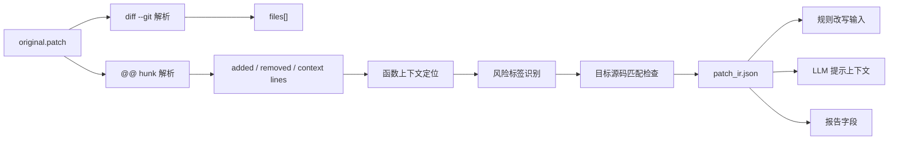

这张图解释了 patch 文本如何变成可供 Agent 使用的结构化信息。系统先解析文件和 hunk，再定位函数并标注风险标签，最后生成 `patch_ir.json`。这个 IR 同时服务三个方向：规则改写、LLM 上下文构造和报告生成，因此它是 patch 处理阶段的核心中间表示。

### 3.9 工作目录结构

工作目录按“批任务目录 + 单 CVE 子目录”组织。批任务目录保存 `run_config.json` 和 `summary.json`。每个 CVE 子目录保存自己的状态、元数据、patch、日志、产物和报告，避免互相覆盖。

```text
<workdir>/
  run_config.json
  summary.json
  CVE-YYYY-NNNN/
    state.json
    metadata/
      raw_nvd.json
      announce_links.json
      candidate_commits.json
      cve_metadata.json
    patches/
      original.patch
      attempt_1.patch
      attempt_2.patch
    logs/
      build_1.log
      build_2.log
      verify_1.log
      dmesg_1.log
    artifacts/
      livepatch.ko
      livepatch.ko.sha256
    patch_ir.json
    context_match.json
    failure.json
    attempt_1.json
    verification.json
    report.json
```

### 3.10 CLI 接口设计

CLI 的基础形式如下：

```bash
run --cves <file> --kernel-version 6.6.102-5.2.an23.x86_64 --workdir <dir>
```

`--cves` 指向逐行 CVE 文件，系统启动时检查文件是否存在，并校验每一行的 CVE 格式。`--kernel-version` 默认使用目标版本 `6.6.102-5.2.an23.x86_64`，如果用户显式传入其他值，也必须写入 `run_config.json` 和 `report.json`。`--workdir` 指向输出目录，系统应创建新运行目录，避免覆盖历史结果。

### 3.11 JSON 接口设计

`report.json` 是单个 CVE 的总报告。它至少应包含 `cve_id`、`kernel_version`、`status`、`sources`、`selected_commit`、`patch_ir`、`change_units`、`attempts`、`final_patch`、`artifact`、`failure_category`、`failure_reason`、`verification` 和 `reproducibility`。其中 `status` 用于表示 `success`、`failed`、`manual_required` 或 `skipped`。

`status` 的含义要严格。`success` 只能在构建成功且加载、卸载验证通过后写入。`failed` 表示自动流程已经走完但无法产出可用模块。`manual_required` 表示系统认为继续自动尝试不安全或证据不足。`skipped` 表示没有必要进入构建，例如输入无效或目标源码已经包含修复。

`patch_ir.json` 是 patch 的结构化表示。它应包含受影响文件、hunk、受影响函数、风险标签、目标源码状态和修复意图摘要。风险标签包括 `init_function`、`static_data`、`global_data`、`struct_abi`、`no_fentry` 和 `symbol_export` 等。

`change_units.json` 是从 `patch_ir.json` 进一步抽取的修改信息。它按文件、函数和语义角色组织 patch 修改，记录 `change_id`、`semantic_role`、新增逻辑、删除逻辑、目标源码匹配状态、风险标签和是否允许自动改写。失败归因、prompt 构造、改写计划和测试断言都应优先引用 `change_id`。

`failure.json` 是失败归因结果。它应说明失败阶段、失败类别、错误信号、相关文件或函数、是否可重试、下一步动作和证据路径。下一步动作可能是 `rewrite`、`fix_env`、`manual_required` 或 `stop`。

失败类别建议保持有限集合，便于统计和规则匹配。第一层字段 `stage` 表示失败发生在哪个阶段，例如 `fetch`、`apply`、`build`、`verify`。第二层字段 `category` 表示错因大类，例如 `patch_apply`、`compile`、`kpatch_limit`、`env_missing`、`verify`、`evidence_missing`。第三层字段 `reason_code` 表示更细的原因，例如 `hunk_failed`、`api_mismatch`、`undefined_symbol`、`no_fentry`、`missing_vmlinux`、`load_failed`。

`failure.json` 还应包含 `signals` 和 `evidence`。`signals` 保存命中的关键词、日志片段摘要或规则 id；`evidence` 保存原始日志路径和行号范围。这样既能让 Agent 继续决策，也能让人工复核时快速定位问题。

`attempt_N.json` 是每轮尝试记录。它说明本轮输入 patch、输出 patch、构建日志、失败原因、改写策略和最终决策。这样即使第 5 轮失败，也可以回看每一轮系统做了什么。

每个 attempt 还应记录“为什么开始这一轮”。例如第 1 轮可能是原始 patch 直接构建，第 2 轮可能是解决上下文漂移，第 3 轮可能是修复目标内核 API 差异。这样报告中可以说明自动改写不是随机试错，而是有明确依据的闭环。

`verification.json` 是运行验证结果。它记录 `.ko` 路径和哈希、目标 VM 的 `uname -r`、加载命令返回码、livepatch 状态、最小功能验证结果、卸载返回码和关键 `dmesg` 路径。

### 3.12 MCP/HTTP 接口设计

MCP/HTTP 接口只作为服务化设计说明，本次文档更新不实现代码。

1. `submit_task` 用于提交任务。输入是 CVE 列表、目标内核版本和运行参数，输出是 `task_id`。服务端收到请求后创建独立工作目录，并启动异步任务。
2. `get_status` 用于查询状态。输入是 `task_id`，输出是任务阶段、每个 CVE 当前状态、尝试轮次和进度摘要。
3. `get_report` 用于获取报告。输入可以是 `task_id` 或单个 CVE ID，输出是 `summary.json` 或单 CVE 的 `report.json`。
4. `get_artifact` 用于获取产物。输入是 `task_id`、CVE ID 和文件类型，输出是 patch、日志、`.ko` 或验证证据路径。该接口只能访问任务目录内的产物，不能读取任意系统路径。

### 3.13 部署架构图

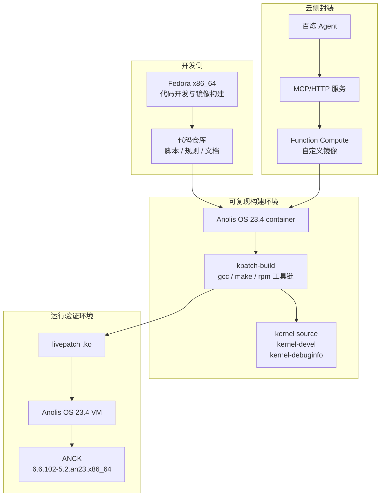

这张部署图把开发、构建、验证和云侧封装分开。Fedora 负责开发和镜像构建，Anolis container 负责可复现构建，Anolis VM 负责真实内核验证，百炼、MCP/HTTP 和 Function Compute 只负责服务入口和调度。这个拆分可以避免把构建成功误认为运行验证成功。

## 第4章 详细设计与实施步骤

本章按照“做什么、输入是什么、输出是什么、为什么这样选型、如何验证、失败后怎么办”的顺序说明每个核心步骤。这里以叙述为主，只在流程或列举场景中使用编号。

### 4.1 环境准备

环境准备是第一优先级。没有固定环境，后续所有成功率统计和失败归因都不可信。系统环境分为三部分：Fedora x86_64 开发宿主机、Anolis OS 23.4 container 构建环境、Anolis OS 23.4 VM 运行验证环境。

Fedora x86_64 用于代码开发、镜像构建和日常调试。Anolis OS 23.4 container 用于可复现构建，内部安装 `kpatch-build`、gcc、make、rpm 工具、目标内核 source、kernel-devel 和 debuginfo。Anolis OS 23.4 VM 用于运行验证，必须启动目标 ANCK 内核 `6.6.102-5.2.an23.x86_64`。

输入是目标内核版本、内核相关 rpm、构建工具和容器构建文件。输出是可复现构建镜像、VM 基线和环境版本记录。验证方式很直接：宿主机工具可执行，容器中 `kpatch-build --help` 成功，VM 中 `uname -r` 输出目标版本。

环境记录需要落到可检查文件中。建议至少记录 OS 版本、容器镜像 digest、`gcc --version`、`make --version`、`kpatch-build --version` 或 help 输出、kernel-devel 路径、debuginfo 中 `vmlinux` 路径，以及目标 VM 的 `uname -r`。

构建容器和验证 VM 的职责要分开。容器用于构建，它不能证明 livepatch 能在目标内核中加载；VM 用于运行验证，它不承担大规模编译任务。这样分层后，环境问题更容易定位。

失败处理也要前置。如果 kernel、kernel-devel、debuginfo、source 或 `vmlinux` 版本不一致，系统应停止构建并归类为 `env_missing`，而不是继续执行并把环境错误误判为 patch 错误。

### 4.2 kpatch 手工基线

自动化之前必须先手工跑通一个最小样例。这个样例不一定必须是正式 CVE，可以是只修改普通非 init 函数的小 patch。目的有两个：确认工具链确实可用，收集后续日志分类器的成功和失败样本。

手工基线的输入是最小 patch、目标源码树、`vmlinux` 和 kernel-devel。输出是样例 patch、构建日志和预期分类。验证方式是最小 patch 能生成 `.ko`，或者失败日志能被人工明确归类。

手工基线不要求一开始就覆盖复杂 CVE。更合理的做法是先选择一个只改普通函数的小 patch，验证工具链通路；再选择一个会触发 kpatch 限制的负例，验证失败归因是否能识别限制。正例和负例都要保存，因为后续日志分类器和演示材料都需要它们。

如果失败来自环境，先修复环境；如果失败来自 kpatch 限制，则把该样例保存为规则库和测试矩阵的负例。

### 4.3 CVE 检索

CVE 检索的任务是从 CVE ID 定位候选修复 commit。系统先查询 NVD，获取漏洞描述、影响版本和参考链接；再查询 Linux CVE announce，寻找公告邮件、修复链路和 stable 线索；最后在 Linux stable 仓库中按 CVE ID、补丁标题、受影响文件和函数名搜索候选 commit。

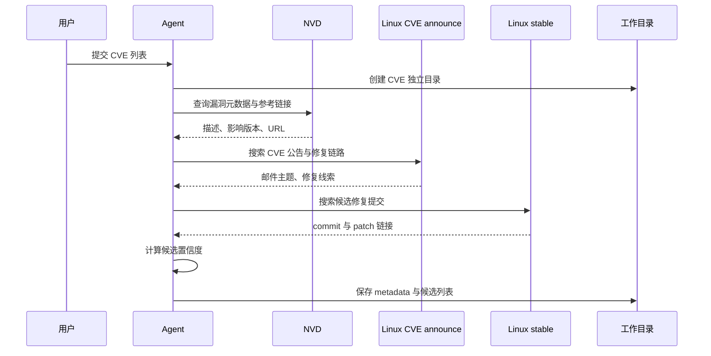

这张时序图说明 CVE 检索不是单一数据源查询，而是多来源交叉确认。Agent 先查 NVD 获取基础描述，再查 Linux CVE announce 获取官方公告线索，最后到 Linux stable 中定位候选修复提交。所有原始响应和候选评分都会写入工作目录，供后续 patch 获取和报告解释使用。

候选评分不是为了追求复杂，而是为了防止系统随便选一个 commit。直接命中 CVE ID 的 commit 置信度最高；修改文件与漏洞描述子系统一致时可以加分；修复进入目标版本邻近 stable 分支时可以加分；邮件公告直接引用该 commit 时可以加分；标题关键词与漏洞描述相似时也可以加分。

候选评分应保留“为什么不是最高分也可能被选中”的解释。例如某个 commit 直接命中 CVE，但不在目标内核相近分支；另一个 commit 没有直接写 CVE，却被 Linux CVE announce 邮件引用，并且修改文件与漏洞描述完全一致。系统应把这种取舍写进 `candidate_commits.json`，避免报告看起来像黑盒选择。

输出文件包括 `raw_nvd.json`、`announce_links.json`、`candidate_commits.json` 和 `cve_metadata.json`。如果来源不足或候选评分过低，系统应标记 `manual_required`，而不是凭空选择 commit。

### 4.4 patch 获取

patch 获取阶段负责把选定 commit 或邮件中的修复保存为 `patches/original.patch`。优先路径是从 Linux stable commit 下载 patch；如果 stable commit 不明确，则从邮件列表保存原始 patch；如果有本地 git 仓库，也可以用 `git format-patch` 生成。

`original.patch` 是不可覆盖文件。后续每轮改写都必须另存为 `attempt_1.patch`、`attempt_2.patch` 等。这样做可以保证任何自动改写都能回溯到原始修复。

patch 来源元数据应至少包含 commit id、commit title、branch、author、来源 URL、获取方式和获取时间。邮件 patch 还应记录邮件主题和 message id。这样即使后续改写失败，也能追溯到原始来源。

验证方式是检查 patch 文件存在，并且包含标题、作者、diff 内容和来源记录。下载失败时先尝试其他来源；所有来源都失败时，报告 `patch_fetch_failed`。

### 4.5 patch 解析

patch 解析的目标是把文本 diff 转换为 `patch_ir.json`。系统先解析受影响文件，再解析每个 hunk 的旧行号、新行号、上下文行、新增行和删除行。随后根据 hunk header、目标源码上下文或 ctags 信息定位受影响函数。

风险标签是 patch 解析的关键输出。修改 `__init` 或初始化路径函数时标注 `init_function`；修改静态局部变量或静态分配数据时标注 `static_data`；修改全局变量时标注 `global_data`；修改结构体布局时标注 `struct_abi`；目标函数缺少可 hook 入口时标注 `no_fentry`；涉及导出符号或模块符号依赖时标注 `symbol_export`。

这些标签不会直接决定成败，但会影响后续策略。比如 `struct_abi` 通常应进入人工介入，`no_fentry` 可以尝试寻找上层调用点，`static_data` 需要判断能否转化为普通运行期逻辑变化。

函数定位不能只依赖 hunk header，因为有些 patch 的 hunk header 不包含准确函数名。实现时可以按优先级处理：先读 hunk header，再在目标源码附近向上搜索函数定义，最后用 ctags 或简单语法扫描兜底。定位不确定时要在 `patch_ir.json` 中标记置信度，而不是假装已经精确定位。

`target_status` 也要细分。`already_fixed` 表示目标源码已包含完整修复；`partially_fixed` 表示部分逻辑已存在但仍缺少关键改动；`need_backport` 表示需要重新适配 hunk；`missing_context` 表示目标源码找不到足够上下文；`unknown` 表示系统无法判断。

`patch_ir.json` 示例：

```json
{
  "files": [
    {
      "path": "net/example.c",
      "status": "modified",
      "hunk_count": 2
    }
  ],
  "functions": [
    {
      "name": "example_check",
      "file": "net/example.c",
      "risk_tags": ["no_fentry"]
    }
  ],
  "target_status": "need_backport",
  "semantic_summary": "增加边界检查，避免异常输入触发越界访问"
}
```

### 4.6 目标内核适配

目标内核适配解决的是 upstream patch 与 ANCK 目标源码树不一致的问题。系统每轮都应从干净源码树开始，先执行 dry-run。如果原始 patch 能直接应用，就进入构建；如果不能应用，就解析 reject 位置，搜索目标源码中的函数名、上下文行和相邻调用。

适配过程中要判断目标源码处于三种状态：已经完整包含修复、部分包含修复、完全缺失修复。已经完整包含修复时可以标记 `skipped`；部分包含修复时需要谨慎生成 backport；完全缺失修复时按目标源码上下文重建 hunk。

输出包括 `context_match.json`、`patches/attempt_N.patch` 和 `rewrite_reason.md`。验证方式是 `git apply --check` 或 dry-run 通过，并且改写说明能解释为什么语义仍与原始 patch 一致。找不到目标函数、上下文冲突过大或语义无法确认时，应进入 `manual_required`。

### 4.7 kpatch 构建

构建阶段调用 `kpatch-build` 生成 livepatch `.ko`。输入是 `attempt_N.patch`、目标源码、`vmlinux`、kernel-devel 和 debuginfo。输出是 `logs/build_N.log`、返回码，以及成功时的 `artifacts/livepatch.ko`。

构建层不负责解释复杂失败，它只负责完整执行和完整记录。每轮构建都要保存 stdout、stderr、返回码和关键命令参数。成功时记录 `.ko` 文件哈希、大小和 `modinfo`；失败时把日志交给失败归因模块。

### 4.8 失败归因

失败归因的目标是把日志变成下一步可行动的结论。系统不能只看最后一行错误，而要先判断失败阶段，再提取相关文件、函数、符号、section 或 CRC 信息。

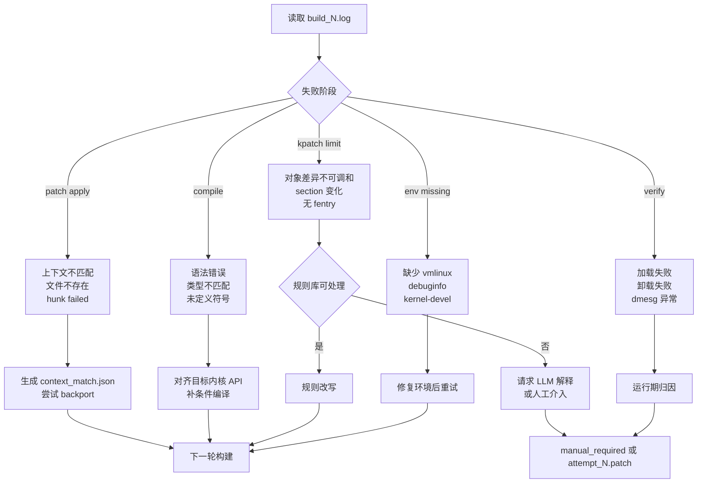

这张图描述失败归因的分流逻辑。系统先判断失败发生在 patch apply、compile、kpatch limit、env missing 还是 verify 阶段，再决定是进入 backport、API 适配、规则改写、环境修复还是人工介入。这样可以避免把所有失败都交给 LLM 改写，也避免环境问题被误当成 patch 问题。

失败类别按阶段理解。`patch_apply` 表示 patch 无法应用，典型信号是 `hunk failed`、上下文不匹配或文件不存在。`compile` 表示普通编译失败，典型信号是语法错误、未定义符号或类型不匹配。`kpatch_limit` 表示 livepatch 约束失败，典型信号是对象差异不可调和、section 变化或无 `fentry`。`env_missing` 表示环境缺失，`verify` 表示运行验证失败。

错因应进一步落到 `reason_code`。这一层用于规则库匹配和统计分析，不宜写成自由文本。建议先覆盖以下常见原因：

1. `hunk_failed`：目标源码上下文与上游 patch 不一致，需要进入 backport 或人工判断。
2. `file_missing`：目标源码中不存在目标文件，可能是版本差异或子系统未启用。
3. `api_mismatch`：函数签名、字段名、宏定义或 helper 不一致，通常可尝试规则改写。
4. `undefined_symbol`：编译阶段找不到符号，需要检查 include、配置、导出符号或版本差异。
5. `type_mismatch`：类型不匹配，可能来自结构体字段变化或函数参数变化。
6. `no_fentry`：目标函数无法被 kpatch hook，需要寻找上层可 hook 调用点。
7. `section_changed`：修改涉及 init、static data、global data 或特殊 section，通常风险较高。
8. `missing_vmlinux`：构建环境缺少与目标内核匹配的 `vmlinux`。
9. `kernel_mismatch`：构建或验证环境的内核版本与 `6.6.102-5.2.an23.x86_64` 不一致。
10. `load_failed`：`.ko` 生成后加载失败，需要结合 `dmesg` 继续归因。

`failure.json` 的结构要兼顾机器决策和人工复核。建议包含四组信息：发生在哪里、看到什么信号、系统如何判断、下一步怎么做。示例如下：

```json
{
  "stage": "build",
  "category": "compile",
  "reason_code": "api_mismatch",
  "severity": "medium",
  "retryable": true,
  "next_action": "rewrite",
  "summary": "上游 patch 调用 example_check 时使用了目标内核不存在的第三个参数",
  "signals": [
    {
      "pattern": "too many arguments to function",
      "source": "logs/build_2.log",
      "line_start": 1842,
      "line_end": 1848
    }
  ],
  "location": {
    "file": "net/example.c",
    "function": "example_check",
    "symbol": "example_check"
  },
  "related_inputs": {
    "patch_ir": "patch_ir.json",
    "attempt_patch": "patches/attempt_2.patch",
    "build_log": "logs/build_2.log"
  },
  "decision_basis": [
    "目标源码中 example_check 只有两个参数",
    "原始 patch 的安全检查逻辑仍可保留",
    "该问题属于 API 差异，不涉及结构体 ABI 改动"
  ]
}
```

如果规则无法分类，系统可以请求 Qwen/百炼解释错误片段。但模型输出仍要被规范化到上述字段中，并标记 `classifier: "llm_assisted"` 或类似字段。无法形成稳定 `reason_code` 时，应进入 `manual_required`，不能把不确定解释作为自动改写依据。

错因还应进入长期失败模式库。每个经过人工确认或多次验证的失败模式，可以沉淀为 `failure_pattern`，供后续 RAG 和规则库召回。它不保存完整日志，只保存关键模式和处理策略。

```json
{
  "pattern_id": "compile.api_mismatch.too_many_arguments",
  "category": "compile",
  "reason_code": "api_mismatch",
  "matchers": [
    "too many arguments to function",
    "error: too few arguments to function"
  ],
  "recommended_action": "rewrite",
  "rewrite_hint": "对比目标源码函数签名，保留安全检查逻辑并适配参数列表",
  "auto_retry_allowed": true,
  "requires_human_review": false
}
```

#### 4.8.1 规则库示例表

规则库应优先覆盖高频、可确定、低语义风险的失败模式。规则命中后可以直接生成 `failure.json` 或 `rewrite_plan.json`；规则未命中时才进入 LLM 辅助解释。规则库不应追求一次覆盖所有内核错误，而应从可复现样例中逐步沉淀。

| 规则 ID | 匹配信号 | 失败类别 | reason_code | 处理动作 | 自动重试 | 人工复核 |
| --- | --- | --- | --- | --- | --- | --- |
| `apply.hunk_failed` | `hunk FAILED`、`patch does not apply` | `patch_apply` | `hunk_failed` | 检索目标函数上下文，尝试 backport | 是 | 否 |
| `apply.file_missing` | `No such file or directory`、目标文件不存在 | `patch_apply` | `file_missing` | 检索重命名路径或进入人工介入 | 否 | 是 |
| `compile.api_args` | `too many arguments to function`、`too few arguments to function` | `compile` | `api_mismatch` | 对比目标函数签名，生成 API 适配计划 | 是 | 否 |
| `compile.implicit_decl` | `implicit declaration of function` | `compile` | `missing_api_or_include` | 检索头文件、宏和替代 helper | 是 | 视情况 |
| `compile.unknown_field` | `has no member named` | `compile` | `field_mismatch` | 判断是否结构体 ABI 变化 | 否 | 是 |
| `kpatch.no_fentry` | `no fentry call`、`function is not traceable` | `kpatch_limit` | `no_fentry` | 查找可 hook 调用者；否则人工介入 | 受限 | 是 |
| `kpatch.data_change` | `data structure layout change`、`static variable changed` | `kpatch_limit` | `struct_or_data_change` | 停止自动改写 | 否 | 是 |
| `env.no_vmlinux` | `vmlinux not found`、`cannot find vmlinux` | `env_missing` | `missing_vmlinux` | 修复环境路径 | 否 | 否 |
| `env.kernel_mismatch` | `uname -r` 与目标版本不一致 | `env_missing` | `kernel_mismatch` | 切换目标 VM 或构建配置 | 否 | 否 |
| `verify.load_failed` | `insmod: ERROR`、`kpatch load failed` | `verify` | `load_failed` | 收集 `dmesg`，停止自动改写 | 否 | 是 |

规则库字段建议保持固定，便于后续 YAML 化：

```yaml
- pattern_id: compile.api_args
  category: compile
  reason_code: api_mismatch
  matchers:
    - "too many arguments to function"
    - "too few arguments to function"
  required_context:
    - target_function_signature
    - affected_change_id
  action: rewrite
  rewrite_strategy: adapt_api
  auto_retry_allowed: true
  requires_human_review: false
  semantic_guard:
    - security_check_must_keep
    - error_return_must_keep
```

规则命中不是最终结论。每条规则都必须给出证据路径、命中的日志片段和关联的 `change_id`。如果只能匹配日志关键词，但无法定位到具体文件、函数或 change unit，系统应降低置信度，并要求人工复核或 LLM 辅助解释。

### 4.9 自动改写闭环

自动改写的输入是 `failure.json`、`patch_ir.json`、源码上下文和上一轮 patch。输出是 `rewrite_plan.json`、`attempt_N.patch` 和 `attempt_N.json`。

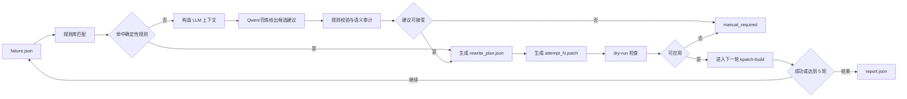

这张图展示自动改写的闭环。失败归因先进入规则库匹配，规则命中时直接生成改写计划；规则不足时才构造 LLM 上下文。无论建议来自规则还是 LLM，都必须经过语义审计和 dry-run 检查，只有可应用的 patch 才能进入下一轮 `kpatch-build`。

常见改写策略按场景处理。上下文漂移时，重新定位目标函数并生成 backport hunk；API 差异时，适配函数签名、字段名或条件编译；静态局部变量变化时，尝试改写为普通运行期逻辑；init 函数变化时，判断是否存在等价运行期调用点；结构体 ABI 变化时，默认进入人工介入；无 `fentry` 函数时，尝试改写到可 hook 的调用点。

自动改写必须有停止条件。目标函数不存在、逻辑差异过大、修复必须依赖 ABI 改动、找不到等价调用点、LLM 建议无法验证或超过 5 轮时，都应停止自动改写并输出 `manual_required` 或 `failed`。

#### 4.9.1 自动改写范围限制

自动改写的边界必须写死在系统规则中，不能由 LLM 临时决定。系统允许自动改写的对象只限于“目标源码中已存在的普通运行期函数”以及“不会改变 ABI、全局状态和生命周期语义的局部逻辑”。改写目标是让原始安全修复适配目标内核，而不是重新设计修复方案。

允许自动改写的范围如下：

| 允许场景 | 说明 | 必须验证 |
| --- | --- | --- |
| 上下文漂移 | 函数仍存在，只是上下文行变化 | `git apply --check` 通过，change unit 语义不变 |
| 函数签名小差异 | 参数数量或名称变化，但缺失参数不影响修复主体 | 对比目标函数签名，保留检查和错误返回 |
| helper/API 名称差异 | 目标内核存在等价 helper 或宏 | 目标源码中能检索到替代符号 |
| include 或条件编译差异 | 缺少声明、宏路径不同 | 不让修复逻辑被条件编译屏蔽 |
| hunk 位置迁移 | 同一函数内代码位置变化 | 修改仍落在同一语义路径内 |
| 上移到调用者 | 目标函数无 fentry，但存在可 hook 调用者 | 调用者路径覆盖原漏洞路径，语义边界不扩大或缩小 |

禁止自动改写的范围如下：

| 禁止场景 | 原因 | 输出 |
| --- | --- | --- |
| 结构体字段新增、删除或布局变化 | 可能改变内核 ABI 或对象布局 | `manual_required` |
| 新增全局变量、静态持久状态或 per-cpu 状态 | livepatch 难以安全表达状态初始化和生命周期 | `manual_required` |
| 引用计数、释放路径、锁顺序和并发语义不清 | 错误改写可能引入 UAF、死锁或竞态 | `manual_required` |
| 初始化路径、模块加载路径或 `__init` 代码 | 运行期可能不会再次执行，热补丁语义不成立 | `manual_required` |
| 删除安全检查或绕过错误返回 | 破坏 CVE 修复语义 | `failed` |
| 目标源码找不到函数、字段、宏或替代 API | 缺少可验证依据 | `manual_required` |
| LLM 建议无法转成 diff 或 dry-run 不通过 | 建议不可执行 | `manual_required` |

自动改写还应有数量和范围上限。默认每个 CVE 最多 5 轮尝试；每轮只改写一个主要 `change_id`；每轮 patch 修改文件数不应超过原始 patch 的受影响文件集合，除非是补 include 或必要的条件编译适配；每轮改写都必须生成 `rewrite_plan.json`，说明改写范围、保留语义和验证步骤。

如果一个改写计划同时修改多个不相关函数，或者把修复逻辑移动到原调用链之外，系统应拒绝该计划。热补丁自动化宁可保守失败，也不能为了生成 `.ko` 扩大修复边界。

#### 4.9.2 基于修改信息的改写输入

自动改写不应直接把整份 patch 交给 LLM，而应先把 patch 拆成若干个 change unit。一个 change unit 表示“在某个文件、某个函数或某个结构位置上的一组语义相关修改”。后续失败归因、规则匹配、LLM prompt 和测试断言都围绕 change unit 展开。

`change_units.json` 建议由 patch 解析阶段生成，结构如下：

```json
{
  "cve_id": "CVE-2026-0001",
  "kernel_version": "6.6.102-5.2.an23.x86_64",
  "fix_intent": {
    "summary": "为边界检查缺失问题增加长度校验并在非法输入时返回错误",
    "source": "commit_message|linux_cve_announce|manual",
    "confidence": 0.82
  },
  "units": [
    {
      "change_id": "CU-001",
      "file": "net/example.c",
      "function": "example_check",
      "change_type": "add_check",
      "semantic_role": "security_boundary_check",
      "added_logic": [
        "检查 len 是否超过 MAX_LEN",
        "非法时返回 -EINVAL"
      ],
      "removed_logic": [],
      "touched_symbols": ["example_check", "MAX_LEN"],
      "target_context": {
        "status": "api_mismatch",
        "target_function_exists": true,
        "signature_changed": true,
        "context_similarity": 0.74
      },
      "risk_tags": ["normal_function_change", "api_mismatch"],
      "rewrite_allowed": true
    }
  ]
}
```

`fix_intent` 用于约束改写不能偏离原始修复语义。它可以来自 commit message、Linux CVE announce、NVD 描述和人工备注。若 `fix_intent.confidence` 过低，系统不应自动改写，只能进入人工介入。

`semantic_role` 是改写判断的关键字段，建议先支持以下类型：

| semantic_role | 含义 | 默认策略 |
| --- | --- | --- |
| `security_boundary_check` | 新增边界、长度、范围、状态检查 | 可自动改写，但必须保留检查和错误返回 |
| `permission_check` | 新增权限或能力校验 | 谨慎改写，必须保留拒绝路径 |
| `refcount_lifetime` | 引用计数、释放、生命周期修复 | 默认人工介入 |
| `locking_order` | 锁顺序、锁范围或并发修复 | 默认人工介入 |
| `struct_abi_change` | 结构体字段或布局变化 | 不自动改写 |
| `init_path_change` | 初始化路径变化 | 默认人工介入，除非存在明确运行期等价点 |
| `logging_only` | 日志或注释变化 | 不进入 livepatch 构建，通常跳过 |

这样设计后，Agent 的决策可以从“模型觉得能不能改”变成“某个 change unit 的语义角色、风险标签和目标上下文是否允许改”。这比直接让 LLM 阅读整份 patch 更稳定，也更容易测试。

#### 4.9.3 改写决策矩阵

Rewrite Advisor 根据 `failure.json` 和 change unit 做决策。建议先实现下面的规则矩阵。

| 失败类别 | change unit 状态 | 自动动作 | 停止条件 |
| --- | --- | --- | --- |
| `patch_apply` | `context_similarity >= 0.65` 且目标函数存在 | 重新定位 hunk，生成 backport patch | 找不到目标函数或相似度过低 |
| `compile` | `api_mismatch` 且 `semantic_role` 为边界检查类 | 适配函数签名、字段名或 helper 名 | 缺失参数影响锁、生命周期或权限语义 |
| `compile` | 缺少 include 或宏定义差异 | 补 include 或条件编译适配 | 宏控制导致修复路径不可达 |
| `kpatch_limit` | 目标函数无 fentry，但存在可 hook 调用者 | 尝试上移到调用者并保留原检查 | 找不到等价调用者或语义边界改变 |
| `kpatch_limit` | 结构体 ABI、全局数据或 init 路径 | `manual_required` | 不允许自动绕过 |
| `verify` | 构建成功但加载失败 | 收集 `dmesg` 并停止 | 不通过改写掩盖加载错误 |

每次决策都应写入 `rewrite_plan.json`：

```json
{
  "attempt_index": 2,
  "source": "rule|llm",
  "input_failure": "failure.json",
  "target_change_id": "CU-001",
  "decision": "rewrite",
  "strategy": "adapt_api",
  "semantic_must_keep": [
    "保留 len > MAX_LEN 检查",
    "非法输入继续返回 -EINVAL"
  ],
  "planned_edits": [
    {
      "file": "net/example.c",
      "function": "example_check",
      "description": "按目标内核中的 example_check 两参数签名重建检查逻辑"
    }
  ],
  "validation_required": [
    "git apply --check patches/attempt_2.patch",
    "kpatch-build",
    "VM load/unload"
  ]
}
```

如果决策来自 LLM，`rewrite_plan.json` 还应保存 prompt 输入摘要和模型输出摘要，但不能保存凭证或完整私密路径。工具层必须再次确认计划中提到的文件、函数、字段和宏确实存在于目标源码中。

### 4.10 运行验证

运行验证在 Anolis OS 23.4 VM 中执行。构建容器只能证明 `.ko` 生成，不能证明模块能在目标内核中安全加载和卸载。

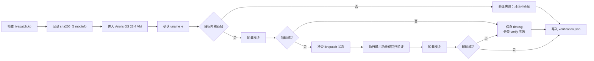

这张图说明验证阶段必须在目标 VM 中完成。系统先确认 `.ko` 产物和目标内核版本，再执行加载、状态检查、最小功能验证和卸载。任何一步失败都要保存 `dmesg` 并写入 `verification.json`，因此报告可以区分“构建成功”“加载成功”和“功能验证通过”。

验证分四层。第一层是构建成功，即 `.ko` 已生成。第二层是加载成功，即模块能进入目标内核。第三层是卸载成功，即模块可回滚。第四层是功能验证通过，即对可构造样例执行最小复现或回归测试并通过。

报告中必须区分这四层，不能把“构建成功”直接写成“漏洞修复成功”。

### 4.11 报告生成

报告生成阶段汇总每个 CVE 的检索、patch、构建、改写、验证和最终结论。`report.json` 是机器可读主格式，Markdown 摘要可以用于答辩展示。

报告状态建议使用四类：

1. `success`：构建成功，加载和卸载验证通过。
2. `failed`：已完成自动尝试，但无法生成或验证产物。
3. `manual_required`：证据不足、语义不明确或风险过高，需要人工处理。
4. `skipped`：输入无效，或目标源码已经包含修复，不进入构建。

报告生成本身也要有失败处理。如果最后汇总阶段出错，系统应保留已有中间文件，并输出最小错误说明，避免因为最后一步异常导致前面所有证据丢失。

### 4.12 MCP/HTTP 与百炼接入

MCP/HTTP 与百炼接入应放在本地 CLI 闭环稳定之后。服务化层负责把 CLI 能力暴露给百炼 Agent，但不改变核心构建流程。

`submit_task` 创建任务和工作目录，返回 `task_id`。`get_status` 查询任务阶段、每个 CVE 当前状态和尝试轮次。`get_report` 返回 `summary.json` 或单 CVE `report.json`。`get_artifact` 返回任务目录内的 patch、日志、`.ko` 或验证证据路径。

Function Compute 自定义镜像可以承载 MCP/HTTP 服务入口和依赖环境。需要注意的是，服务端必须做参数白名单校验，不允许任意 shell 命令；每个请求必须创建独立工作目录，限制并发和磁盘配额；百炼 Agent 只负责自然语言交互和报告摘要，不直接操作底层构建环境。

### 4.13 Agent 搭建实施步骤

Agent 的搭建应从本地可运行的 CLI Agent 开始，而不是一开始就把所有能力放到百炼平台里。内核构建、日志解析、patch dry-run、VM 验证都依赖本地文件系统和目标环境，本地 Agent 更利于调试、复现和证据留存。

第一阶段搭建本地 Agent。它包含 Planner、Tool Router、State Manager、Evidence Collector、Rewrite Advisor、Verifier 和 Reporter 七个组件。每个组件先以普通 Python 模块实现，通过 `run --cves ...` 串起来。这个阶段不要求大模型参与所有步骤，优先保证状态流转和工具调用稳定。

第二阶段接入 LLM。LLM 只放在三个位置：复杂失败解释、改写候选建议、报告摘要生成。CVE 检索、patch 应用检查、构建执行和 VM 验证仍由确定性工具完成。这样可以避免 Agent 把不可验证的语言推理当作真实执行结果。

第三阶段封装 MCP/HTTP。等本地 CLI 能稳定输出 `report.json` 后，再把 CLI 包成服务。MCP tool 可以映射到 `submit_task`、`get_status`、`get_report`、`get_artifact`。百炼 Agent 调用这些 tool 时，只负责交互和解释报告，不直接拼接底层命令。

本地 Agent 的一次执行可以按下面的顺序实现：

1. `TaskLoader` 读取 `cves.txt`，创建批任务目录。
2. `Planner` 为每个 CVE 创建初始 `state.json`。
3. `Tool Router` 根据状态调用检索、patch、构建、验证工具。
4. `State Manager` 每完成一步就更新状态。
5. `Evidence Collector` 把日志、patch、来源和哈希落盘。
6. `Rewrite Advisor` 只在失败可重试时参与。
7. `Reporter` 汇总单 CVE 报告和整批摘要。

这个顺序的好处是每一步都可以单独测试。即使暂时没有接入百炼，也能先证明本地流程可用。

实现时可以按模块目录组织 Agent 代码。`agent/planner.py` 负责状态判断，`agent/tools/` 保存白名单工具封装，`agent/state.py` 负责 JSON 读写，`agent/rag/` 保存索引、召回和 evidence pack 逻辑，`agent/rewrite.py` 负责规则与 LLM 建议整合，`agent/verify.py` 负责 VM 验证，`agent/report.py` 负责报告生成。

各模块之间只传结构化对象和文件路径，不传未约束的大段终端输出。这样可以降低模块耦合，也方便在 MCP/HTTP 服务化时把内部函数映射成可控接口。

### 4.14 Agent RAG 知识库建设

RAG 的目标不是让模型泛泛“了解内核”，而是让每次 Agent 决策都能绑定证据。对本项目来说，RAG 知识库至少分成四类。

1. 第一类是漏洞与修复知识。来源包括 NVD、Linux CVE announce、Linux stable commit、邮件列表 patch 和上游 commit message。它主要服务 CVE 检索和 commit 选择，回答“这个 CVE 对应哪个修复”“该修复是否进入 stable”“候选 commit 为什么可信”。
2. 第二类是目标源码知识。来源是 ANCK `6.6.102-5.2.an23.x86_64` 对应源码树。它主要服务 patch 解析、上下文匹配和 backport，回答“目标源码有没有这个函数”“上下文是否一致”“目标内核里有没有替代 API”。
3. 第三类是工具和约束知识。来源包括 `kpatch-build` 日志样例、kpatch 文档、livepatch 限制说明、项目沉淀的失败规则。它主要服务失败归因和改写策略，回答“这个错误是否是 kpatch 限制”“是否可以自动改写”“什么时候必须人工介入”。
4. 第四类是项目经验知识。来源是本项目已经跑过的成功案例、失败案例、环境记录和人工确认结果。它主要服务后续 CVE 的复用，回答“类似错误以前怎么处理”“这个目标内核里某个 API 差异是否出现过”。

知识库落盘可以先用文件系统实现，不必一开始就上复杂向量数据库。更专业的设计是把数据库拆成三部分：`raw_store` 保存原始材料，`metadata_index` 保存结构化字段，`vector_index` 保存可语义检索的文本表示。三者之间通过 `chunk_id` 和 `evidence_path` 关联。

建议目录如下：

```text
knowledge/
  cve_sources/
    nvd/
    linux_cve_announce/
    stable_commits/
  source_index/
    files.json
    functions.json
    symbols.json
  kpatch_rules/
    failure_patterns.yaml
    rewrite_strategies.yaml
  cases/
    success/
    failed/
    manual_required/
  index/
    chunks.jsonl
    metadata_index.jsonl
    vector_index_manifest.json
    retrieval_eval.json
```

`chunks.jsonl` 保存每个 chunk 的正文和 metadata。`metadata_index.jsonl` 保存用于过滤的字段，例如 CVE、文件、函数、commit、错误类别和目标内核版本。`vector_index_manifest.json` 记录向量索引的构建时间、embedding 模型名称、数据范围和版本。`retrieval_eval.json` 保存召回率评估结果，便于说明 RAG 策略是否有效。

如果后续要接入向量检索，可以只对“自然语言和半结构化内容”做 embedding，例如 NVD 描述、邮件正文、commit message、失败日志摘要、人工处理记录。内核源码不建议完全依赖向量检索，因为函数名、路径、符号名这类精确匹配更重要。

RAG 入库要有清洗步骤。原始网页、邮件和日志中可能包含大量无关内容，应先抽取标题、正文摘要、来源 URL、commit id、文件路径、函数名和错误片段，再生成 chunk。对于同一来源的重复内容，应使用 hash 去重，并保留第一个 evidence path。

RAG 出库要有引用约束。Planner 给 LLM 的 evidence pack 不能只包含一段文本，还要包含 `chunk_id`、`source_type`、`evidence_path`、`confidence` 和命中原因。LLM 输出建议时必须引用这些 id，Reporter 才能把建议和证据对应起来。

一个 evidence pack 可以设计为：

```json
{
  "query_id": "rewrite:CVE-2026-0001:attempt_2",
  "purpose": "explain_build_failure_and_propose_rewrite",
  "items": [
    {
      "chunk_id": "log:CVE-2026-0001:build_2:compile:001",
      "source_type": "log",
      "evidence_path": "logs/build_2.log",
      "matched_by": ["reason_code", "function_name"],
      "confidence": 0.86
    },
    {
      "chunk_id": "source:net/example.c:example_check",
      "source_type": "source",
      "evidence_path": "knowledge/source_index/functions.json",
      "matched_by": ["function_name", "file_path"],
      "confidence": 0.92
    }
  ]
}
```

这个 evidence pack 是 LLM 输入的边界。它明确告诉模型哪些证据可用，也让系统能够审计模型是否引用了不存在的材料。

### 4.15 Chunk 拆分策略

Chunk 拆分要根据资料类型分别设计，不能把所有文件按固定字数切开。内核项目里很多关键信息来自路径、函数名、hunk、符号和日志片段，粗暴按长度切分会破坏上下文。

对 NVD 和邮件公告，chunk 可以按语义段落拆。一个 chunk 保存 CVE ID、标题、描述、影响版本、参考链接和来源 URL。邮件列表中如果包含 patch 链接或 commit 链接，要单独抽成字段，便于后续精确召回。

对 Linux stable commit，chunk 应以 commit 为单位。一个 commit chunk 保存 commit id、标题、作者、日期、修改文件列表、commit message、patch URL 和 diff 摘要。diff 本体可以单独保存，不必全部放进 embedding 文本。

对 patch，chunk 应按文件和 hunk 拆。文件级 chunk 说明修改了哪个路径、文件状态是什么、涉及哪些函数。hunk 级 chunk 保存 hunk header、上下文行、增删行和推测函数名。这样改写时可以只召回相关 hunk，而不是整份 patch。

对目标源码，chunk 应以函数为基本单位。函数 chunk 保存文件路径、函数名、起止行号、函数签名、调用关系摘要和相邻上下文。对于结构体、宏、全局变量和导出符号，可以建立单独 symbol chunk。

对构建日志，chunk 应按错误块拆。一个错误块包括错误前后若干行、编译命令片段、文件路径、函数名、错误类型和匹配到的规则。日志 chunk 不需要保存完整日志，完整日志仍放在 `logs/` 中。

为了提高后续召回质量，每个 chunk 都要带 metadata。建议至少包含：

- `source_type`：NVD、mail、commit、patch、source、log、case。
- `cve_id`：关联 CVE。
- `kernel_version`：目标内核版本。
- `file_path`：源码或 patch 路径。
- `function_name`：函数名。
- `symbol_name`：符号名。
- `commit_id`：上游提交。
- `risk_tags`：kpatch 风险标签。
- `evidence_path`：本地证据文件路径。

拆 chunk 时要控制大小。自然语言 chunk 可以稍长，源码函数 chunk 应尽量保持一个函数一个 chunk，日志 chunk 应只包含一个错误块。过大的 chunk 会降低召回准确度，过小的 chunk 又会丢失语义；本项目更适合“结构化 metadata + 中等长度正文”的方案。

### 4.16 提高 RAG 召回率的方法

提高召回率不能只靠向量相似度。内核补丁场景里，很多关键线索是精确字符串，例如 CVE ID、函数名、文件路径、commit id、符号名和错误码。因此召回应采用混合检索。

1. 第一层是精确召回。先用 CVE ID、commit id、文件路径、函数名、符号名、错误关键词做精确匹配。这一层可以用 `rg`、倒排索引、JSON metadata 过滤完成。它的优点是可靠，不容易被相似但无关的语义干扰。
2. 第二层是语义召回。对 NVD 描述、邮件正文、commit message、失败摘要和人工案例做 embedding 检索。它用于补充“描述相似但关键词不同”的情况，例如漏洞描述没有直接写函数名，但语义上指向同一个子系统。
3. 第三层是图谱式扩展召回。命中一个函数后，可以扩展召回同文件相邻函数、调用者、被调用 helper、相关宏和结构体定义。命中一个 commit 后，可以扩展召回同 patch series、同 stable 分支 backport、同文件历史 commit。
4. 第四层是 rerank。召回结果不能直接给 LLM，需要按证据强弱排序。排序因素包括 CVE ID 是否直接命中、文件路径是否一致、函数名是否一致、目标内核版本是否邻近、是否来自官方来源、是否已有成功案例验证。

为了避免漏召回，查询也要扩展。例如一个 CVE 查询可以同时生成多种 query：

1. CVE 原始编号。
2. NVD 描述关键词。
3. 受影响子系统。
4. 候选文件路径。
5. 候选函数名。
6. commit title 关键词。

为了避免误召回，还要设置证据门槛。只有语义相似但没有文件、函数、commit 或来源支撑的结果，不能直接作为决策依据。它可以进入“候选参考”，但不能驱动 patch 选择或自动改写。

召回率评估也要落地。可以准备一组已知 CVE 样例，标注正确 commit、正确文件、正确函数和正确失败类型。每次调整 RAG 策略后，检查 top-1、top-3、top-5 是否召回正确证据。这样才能证明 RAG 在变好，而不是只是内容变多。

### 4.17 Agent 记忆处理

Agent 记忆不能等同于对话历史。本项目的记忆应落到文件和结构化索引中，保证中断后可恢复、多人协作可审计、答辩时可展示。

短期记忆只服务当前一步决策。它来自当前 CVE 的 `state.json`、最近一次 `attempt_N.json`、最近一次 `failure.json` 和 Planner 当前候选动作。短期记忆不需要长期保存，因为它可以从任务目录重建。

任务记忆服务单个 CVE 的完整生命周期。它包括 `metadata/`、`patches/`、`logs/`、`patch_ir.json`、`context_match.json`、`failure.json`、`verification.json` 和 `report.json`。任务记忆的作用是让 Agent 能从任意阶段恢复，并解释每次尝试的原因。

长期经验记忆服务多个 CVE。它保存已经验证过的失败模式、改写策略和案例。例如某类 `hunk failed` 如何定位上下文，某类 API 差异在 ANCK 里应该替换成哪个 helper，某类 kpatch 错误应直接人工介入。

环境记忆记录构建和运行环境。它包括容器镜像 digest、目标 kernel rpm 版本、kernel-devel 路径、debuginfo 路径、`vmlinux` 路径、VM `uname -r` 和工具版本。环境记忆能帮助 Agent 判断失败是否由版本错配导致。

记忆写入要有门槛。成功构建且验证通过的策略可以写入长期经验记忆；人工确认过的失败归因可以写入失败模式库；未验证的 LLM 建议只能留在当前 attempt 里，不能沉淀为规则。

记忆读取也要有优先级。当前 CVE 的任务记忆优先级最高，目标内核环境记忆次之，相似历史案例再次之。长期经验记忆只能提供建议，不能覆盖当前源码、当前日志和当前验证结果。

记忆还需要过期和版本隔离。针对 `6.6.102-5.2.an23.x86_64` 的 API 替代经验，不一定适用于其他内核版本。长期记忆必须带 `kernel_version` 字段，否则后续扩展到其他版本时容易误用。

长期记忆建议拆成三个 JSONL 文件维护。`failure_memory.jsonl` 保存已确认失败模式，`rewrite_memory.jsonl` 保存已验证改写策略，`environment_memory.jsonl` 保存环境基线和版本信息。拆开保存的好处是读取时可以按场景加载，避免把无关历史都放入当前决策。

失败记忆的最小结构如下：

```json
{
  "memory_id": "failure:compile:api_mismatch:example_check",
  "kernel_version": "6.6.102-5.2.an23.x86_64",
  "category": "compile",
  "reason_code": "api_mismatch",
  "signature": {
    "file_path": "net/example.c",
    "function_name": "example_check",
    "log_patterns": ["too many arguments to function"]
  },
  "observed_in": ["CVE-2026-0001"],
  "recommended_action": "rewrite",
  "confidence": "confirmed_by_build"
}
```

改写记忆只保存验证过的策略，不能保存纯自然语言猜测。它应记录适用条件、改写动作、验证证据和不适用边界。

```json
{
  "memory_id": "rewrite:api_mismatch:drop_removed_flag",
  "kernel_version": "6.6.102-5.2.an23.x86_64",
  "applies_when": [
    "目标函数参数数量少于上游函数",
    "缺失参数只影响日志或 flag 控制",
    "安全检查主体逻辑不依赖该参数"
  ],
  "rewrite_action": "按目标函数签名重建调用，保留边界检查和错误返回路径",
  "validated_by": {
    "cve_id": "CVE-2026-0001",
    "report": "cases/success/CVE-2026-0001/report.json"
  },
  "not_applicable_when": [
    "缺失参数影响锁、引用计数或内存生命周期",
    "涉及结构体 ABI 改动"
  ]
}
```

记忆写入应由 Reporter 或专门的 Memory Manager 完成，而不是由 LLM 直接写入。写入前至少要检查三件事：当前结论是否有构建或人工确认依据；目标内核版本是否明确；证据路径是否存在。缺少任何一项时，只能保存为当前任务记录，不能提升为长期记忆。

### 4.18 Agent 编排循环

Agent 编排不是简单的 `while true` 重试。每轮循环都要有明确的进入条件、退出条件和证据。

一次 CVE 处理循环可以拆成以下阶段：

1. `Resolve`：检索 CVE 元数据和候选 commit。
2. `Fetch`：获取原始 patch。
3. `Analyze`：生成 `patch_ir.json` 和风险标签。
4. `Adapt`：适配目标源码并生成 attempt patch。
5. `Build`：执行 `kpatch-build`。
6. `Classify`：失败时生成 `failure.json`。
7. `Rewrite`：可重试时生成下一轮 patch。
8. `Verify`：构建成功后加载和卸载验证。
9. `Report`：写入最终报告。

Planner 每轮只做一个决策，不跨越多个阶段。比如它不能在还没有 `patch_ir.json` 的情况下直接调用 LLM 改写，也不能在 `.ko` 未生成时进入 VM 验证。

循环退出条件要清楚。成功退出要求构建成功、加载成功、卸载成功，并写入报告。失败退出包括重试超过 5 轮、不可热补丁化、环境缺失无法自动修复、证据不足或语义无法确认。

为了让编排可观察，每个阶段都应写入 `event` 记录。event 至少包含时间、阶段、输入路径、输出路径、返回码和摘要。这样后续可以生成一条时间线，说明 Agent 从 CVE 到结论经历了哪些动作。

### 4.19 Agent 评估与调优

Agent 的效果不能只用“最终成功率”衡量。热补丁场景里，错误地成功比清楚地失败更危险。因此评估指标要覆盖检索、归因、改写和验证。

#### 4.19.1 实验评价指标

实验评价指标分为六组。每组都要有输入样例、期望输出和可计算结果，避免只用主观描述证明系统有效。

| 指标组 | 指标名称 | 计算方式 | 目标含义 |
| --- | --- | --- | --- |
| CVE 检索 | `commit_top1_accuracy` | 正确修复 commit 排名第 1 的样例数 / 有标注样例数 | 衡量检索首选 commit 是否可靠 |
| CVE 检索 | `commit_top3_recall` | 正确修复 commit 进入前 3 的样例数 / 有标注样例数 | 衡量候选集合是否覆盖正确证据 |
| 修改信息抽取 | `change_unit_precision` | 正确 change unit 数 / 系统抽取 change unit 数 | 衡量系统是否少抽无关修改 |
| 修改信息抽取 | `change_unit_recall` | 正确 change unit 数 / 人工标注 change unit 数 | 衡量系统是否漏掉关键修改 |
| 修改信息抽取 | `semantic_role_accuracy` | `semantic_role` 判断正确数 / change unit 总数 | 衡量系统是否理解修改类型 |
| 失败归因 | `failure_category_accuracy` | 失败类别正确数 / 失败样例总数 | 衡量 `patch_apply`、`compile`、`kpatch_limit` 等分类是否准确 |
| 失败归因 | `reason_code_accuracy` | 细分原因正确数 / 失败样例总数 | 衡量 `api_mismatch`、`no_fentry` 等原因是否准确 |
| 改写决策 | `rewrite_decision_accuracy` | rewrite/manual/stop 决策正确数 / 改写样例总数 | 衡量系统是否该改才改、该停则停 |
| 改写质量 | `rewrite_apply_rate` | 改写 patch dry-run 通过数 / 生成改写 patch 数 | 衡量改写 patch 是否可应用 |
| 改写质量 | `rewrite_build_improvement_rate` | 改写后失败阶段推进或构建成功数 / 改写尝试数 | 衡量改写是否真正改善构建结果 |
| 语义安全 | `unsafe_success_count` | 构建成功但人工判定语义偏离的样例数 | 该指标目标值必须为 0 |
| 验证 | `load_unload_pass_rate` | 加载卸载通过样例数 / 生成 `.ko` 样例数 | 衡量产物是否能在目标 VM 生效和回滚 |
| 报告 | `evidence_completeness_rate` | 必需证据字段完整报告数 / 报告总数 | 衡量报告是否可复现和可审计 |

其中 `unsafe_success_count` 是最高优先级指标。即使最终 `.ko` 生成率较高，只要出现“语义不可信但报告为成功”的样例，系统就不能算通过。热补丁场景中，清楚地失败比错误地成功更安全。

实验样例建议分成三组：

1. 标注检索集：用于评价 CVE 到 commit 的 top-k 命中。
2. 标注 patch 集：用于评价 `change_units.json`、风险标签和语义角色。
3. 构建验证集：用于评价失败归因、改写决策、`.ko` 生成和 VM 验证。

每次实验输出 `evaluation_summary.json`：

```json
{
  "dataset_version": "anck-6.6.102-eval-v1",
  "kernel_version": "6.6.102-5.2.an23.x86_64",
  "metrics": {
    "commit_top3_recall": 0.86,
    "semantic_role_accuracy": 0.8,
    "failure_category_accuracy": 0.9,
    "rewrite_decision_accuracy": 0.85,
    "rewrite_apply_rate": 0.75,
    "load_unload_pass_rate": 0.67,
    "unsafe_success_count": 0
  },
  "failed_cases": [
    {
      "case_id": "cu_api_mismatch_003",
      "metric": "rewrite_apply_rate",
      "reason": "generated patch did not pass dry-run"
    }
  ]
}
```

这些指标也可以用于项目迭代排序。若 `commit_top3_recall` 低，优先补检索来源和 RAG；若 `semantic_role_accuracy` 低，优先改 patch 解析和 change unit 规则；若 `rewrite_apply_rate` 低，优先收紧改写范围；若 `unsafe_success_count` 大于 0，则必须暂停自动改写并复查语义审计规则。

检索评估看正确 commit 是否进入 top-k。可以用已知 CVE 样例建立小型标注集，检查 top-1、top-3、top-5 召回率。若正确 commit 经常不在 top-5，说明 RAG 查询扩展或数据源覆盖不足。

归因评估看失败分类是否准确。准备 patch apply、compile、kpatch_limit、env_missing、verify 五类日志样例，检查 `failure.json` 是否给出正确类别和证据。

改写评估看三件事：patch 是否可应用，构建错误是否减少，修复语义是否保留。只要语义无法确认，即使构建成功，也不能记为高质量成功。

验证评估看证据是否完整。每个成功样例至少要有 `.ko` 哈希、VM `uname -r`、加载返回码、状态检查、卸载返回码和关键 `dmesg`。缺少这些证据时，报告只能写构建成功，不能写验证通过。

调优时应优先处理高频、低风险问题。例如上下文漂移、API 小差异、缺少 include、条件编译差异通常适合自动化；结构体 ABI、初始化路径、全局数据变化则应谨慎处理，宁可人工介入。

## 第5章 测试验证方案

### 5.1 测试目标

测试章只围绕本项目最关键的几件事展开：修改信息是否抽取得准、失败是否归因到具体 change unit、改写计划是否保留修复语义、提示词输出是否受约束、最终报告是否能复现结论。这样比泛泛测试“CLI、HTTP、服务接口”更贴合系统难点。

本章不把测试重点放在“接口能不能调用”上，而是放在下面五个判断：

1. `change_units.json` 能否准确表达 patch 修改了什么。
2. `failure.json` 能否指出失败发生在哪个 change unit 上。
3. `rewrite_plan.json` 能否说明为什么允许或禁止自动改写。
4. LLM prompt 的输出能否稳定满足 JSON schema 和安全约束。
5. `report.json` 能否把修改信息、失败证据、改写尝试和验证结果串起来。

### 5.2 测试样例组织

测试样例不按“成功/失败”粗分，而按修改信息类型组织。每个样例都要包含原始 patch、期望 change unit、期望失败或改写结果。

```text
tests/cases/
  cu_boundary_check_success/
    original.patch
    target_context.txt
    build.log
    expected_change_units.json
    expected_failure.json
    expected_rewrite_plan.json
  cu_api_mismatch_rewrite/
    original.patch
    target_context.txt
    build.log
    expected_change_units.json
    expected_rewrite_plan.json
  cu_struct_abi_manual/
    original.patch
    target_context.txt
    expected_change_units.json
    expected_rewrite_plan.json
  cu_no_fentry_manual/
    original.patch
    build.log
    expected_failure.json
  prompt_failure_classify/
    prompt_input.json
    expected_output_schema.json
```

每个样例的 `expected_change_units.json` 至少断言以下字段：

```json
{
  "units": [
    {
      "change_id": "CU-001",
      "file": "net/example.c",
      "function": "example_check",
      "change_type": "add_check",
      "semantic_role": "security_boundary_check",
      "risk_tags": ["normal_function_change"],
      "rewrite_allowed": true
    }
  ]
}
```

这样测试能直接回答“系统是否真的理解了修改信息”，而不是只看 patch 文件有没有被解析成 hunk。

### 5.3 修改信息抽取测试

修改信息抽取测试验证 `patch_ir.json` 和 `change_units.json`。它不需要真实构建环境，可以作为快速测试执行。

| 用例 | 输入特征 | 必须断言 |
| --- | --- | --- |
| 新增边界检查 | 新增 `if` 检查和错误返回 | `semantic_role=security_boundary_check`，`rewrite_allowed=true` |
| 权限检查 | 新增 capability 或权限判断 | `semantic_role=permission_check`，记录拒绝路径 |
| 引用计数修复 | 新增 get/put 或释放路径 | `semantic_role=refcount_lifetime`，`rewrite_allowed=false` |
| 结构体字段变化 | 修改 struct 定义或新增字段 | `semantic_role=struct_abi_change`，风险标签包含 `struct_abi_risk` |
| init 路径变化 | 修改 `__init` 或初始化文件 | `semantic_role=init_path_change`，默认人工介入 |
| 日志变化 | 只改 printk 或注释 | `semantic_role=logging_only`，不进入 livepatch 构建 |

通过标准是字段匹配，而不是自然语言描述相似。比如结构体字段变化样例只要被判成 `normal_function_change`，即使后续流程能跑，也应判定测试失败。

### 5.4 失败归因测试

失败归因测试输入是 `build.log`、`apply_check.log`、`patch_ir.json` 和 `change_units.json`，输出是 `failure.json`。

重点断言四个字段：

```json
{
  "category": "compile",
  "reason_code": "api_mismatch",
  "affected_change": {
    "change_id": "CU-001",
    "file": "net/example.c",
    "function": "example_check"
  },
  "retryable": true
}
```

测试矩阵如下：

| 失败日志信号 | 期望类别 | 期望 reason_code | 是否可重试 |
| --- | --- | --- | --- |
| `hunk FAILED` | `patch_apply` | `context_mismatch` | 是 |
| `too few arguments to function` | `compile` | `api_mismatch` | 是 |
| `implicit declaration of function` | `compile` | `missing_api_or_include` | 是 |
| `no fentry call` | `kpatch_limit` | `no_fentry` | 否或需人工确认 |
| `data structure layout change` | `kpatch_limit` | `struct_abi_change` | 否 |
| `vmlinux not found` | `env_missing` | `missing_vmlinux` | 否，需修环境 |
| `insmod: ERROR` | `verify` | `load_failed` | 否 |

这组测试的目标是避免系统只给出“构建失败”这种无效结论。失败必须落到可执行动作：改写、修环境、停止或人工介入。

### 5.5 改写决策测试

改写决策测试输入是 `failure.json` 和 `change_units.json`，输出是 `rewrite_plan.json`。这里重点不测试最终 patch 是否完美，而是测试系统是否作出正确的允许或禁止决策。

| 场景 | 输入条件 | 期望 decision | 必须保留 |
| --- | --- | --- | --- |
| 上下文漂移 | 目标函数存在，相似度高 | `rewrite` | 原始检查和错误返回 |
| API 小差异 | 缺少参数不影响安全检查主体 | `rewrite` | 安全检查主体逻辑 |
| include 缺失 | 编译错误为缺少声明 | `rewrite` | 不改变修复逻辑 |
| 无 fentry | 目标函数不可 hook | `manual_required` 或受控上移 | 不改变修复边界 |
| 结构体 ABI | 修改结构体字段 | `manual_required` | 不允许绕过 ABI |
| 引用计数 | 涉及生命周期 | `manual_required` | 不允许模型猜测 |

`rewrite_plan.json` 必须包含 `semantic_must_keep`。如果计划只说“适配 API”但没有写清楚必须保留哪些安全语义，测试应失败。

### 5.6 Prompt 输出测试

Prompt 测试不评估模型“说得好不好”，只评估输出是否可控、可解析、可验证。测试输入使用固定 fixture，避免实时模型波动影响基础测试。

失败解释 prompt 的测试点：

- 输出必须是合法 JSON。
- `category` 必须属于白名单。
- `evidence` 必须引用输入日志中的真实信号。
- 不能出现输入中不存在的文件、函数、commit。
- `recommended_action` 必须属于 `rewrite`、`manual_required`、`fix_environment`、`stop`。

patch 改写 prompt 的测试点：

- 输出只能是改写计划，不能直接声称构建成功。
- 如果输入包含 `struct_abi_change`，必须输出 `manual_required`。
- 如果输入中的目标函数不存在，不能建议在该函数内改写。
- `validation_plan` 必须包含 dry-run 和构建验证。
- `semantic_must_keep` 不能为空。

可以为 prompt 输出增加一个 schema 校验命令：

```bash
pytest tests/prompt/test_failure_prompt.py
pytest tests/prompt/test_rewrite_prompt.py
```

正式接入 Qwen/百炼后，prompt 测试分两层：fixture 层验证模板和 schema，在线层只做抽样验证，不把实时模型输出作为唯一验收依据。

### 5.7 端到端样例

端到端样例只保留少量高价值样例，避免测试章失焦。

| 样例 | 目标 | 必须产物 |
| --- | --- | --- |
| 最小成功样例 | 普通函数边界检查可热补丁化 | `.ko`、`verification.json`、`report.json` |
| API mismatch 可改写样例 | 第 1 轮编译失败，第 2 轮改写成功 | `failure.json`、`rewrite_plan.json`、`attempt_2.patch` |
| 结构体 ABI 禁止样例 | 验证系统不会强行生成风险产物 | `manual_required` 报告 |
| 无 fentry 样例 | 验证 kpatch 限制识别 | `failure.category=kpatch_limit` |
| 加载失败样例 | 验证构建成功不等于验证成功 | `verification.json.result=failed` |

每个端到端样例的通过标准都应写在 `expected.json` 中，例如：

```json
{
  "expected_report_status": "manual_required",
  "expected_failure_category": "kpatch_limit",
  "expected_reason_code": "struct_abi_change",
  "must_exist": [
    "patch_ir.json",
    "change_units.json",
    "failure.json",
    "report.json"
  ],
  "must_not_exist": [
    "artifacts/livepatch.ko"
  ]
}
```

### 5.8 验收口径

验收时重点展示三条证据链。

第一条是成功链：`CVE -> selected_commit -> original.patch -> change_units.json -> attempt_N.patch -> livepatch.ko -> verification.json -> report.json`。

第二条是可改写失败链：`build.log -> failure.json -> affected_change.change_id -> rewrite_plan.json -> attempt_N.patch -> 下一轮构建结果`。

第三条是不可改写失败链：`patch_ir.json/change_units.json -> risk_tags/semantic_role -> manual_required -> report.json`。

如果系统能清楚展示这三条链路，测试就能支撑答辩。反过来，如果测试只能展示“跑了 pytest”或“接口返回 200”，说明测试没有覆盖本项目真正的难点。

### 5.9 实验结果记录

测试执行结束后应生成实验结果文件，而不是只保留终端输出。建议每次实验生成以下三类文件：

```text
eval/
  run_YYYYMMDD_HHMM/
    evaluation_summary.json
    case_results.jsonl
    metric_breakdown.json
```

`case_results.jsonl` 逐条记录样例结果，便于定位失败：

```json
{
  "case_id": "cu_api_mismatch_rewrite_001",
  "expected_status": "success_after_rewrite",
  "actual_status": "success_after_rewrite",
  "expected_change_id": "CU-001",
  "failure_category": "compile",
  "reason_code": "api_mismatch",
  "rewrite_decision": "rewrite",
  "dry_run_passed": true,
  "build_passed": true,
  "verify_passed": true,
  "report": "runs/.../report.json"
}
```

`metric_breakdown.json` 按阶段记录指标，便于答辩时说明系统能力边界。例如某次实验可以明确说明：检索阶段 top-3 召回较高，但改写 dry-run 通过率仍不足，因此下一步应优先改进 backport 规则，而不是继续增加 LLM prompt 长度。

实验结果中应单独列出人工复核项。凡是涉及结构体 ABI、引用计数、锁、初始化路径和无 fentry 上移的样例，都需要标记是否经过人工确认。没有人工确认的样例不能用于提升长期规则库，只能作为当前实验记录。

## 第6章 风险控制与项目推进

### 6.1 风险控制

CVE 定位错误是高风险。预防方式是使用 NVD、Linux CVE announce 和 Linux stable 多来源交叉验证，并把候选评分落盘。兜底方式是置信度不足时进入人工介入。

patch 改写偏离语义是高风险。预防方式是规则优先，LLM 建议必须转成 diff 并经过审计。兜底方式是无法确认语义时停止自动改写。

目标环境不一致是高风险。预防方式是固定 Anolis 版本、目标内核包和构建镜像。兜底方式是在报告中记录环境差异并归类为环境失败。

kpatch 限制不可绕过是中等风险。预防方式是建立风险标签和不可热补丁化规则。兜底方式是输出清晰失败原因，而不是强行生成风险产物。

数据源不稳定是中等风险。预防方式是保存原始响应并支持本地缓存。兜底方式是用邮件列表、git 仓库和参考链接互相补充。

云侧环境无法直接构建是中等风险。预防方式是先完成本地 CLI，云侧只做封装。兜底方式是 Function Compute 负责调度，构建在专用环境执行。

批处理资源占用过高是中等风险。预防方式是限制并发、磁盘配额和任务超时。兜底方式是每个 CVE 独立失败，不影响整批任务。

### 6.2 项目推进甘特图

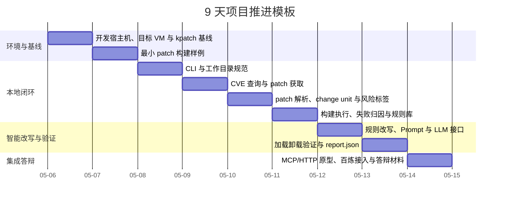

这张甘特图给出项目推进顺序。前半段先解决环境、工具链和最小样例，保证本地构建基础可靠；中段实现 CLI、检索、解析、构建和日志分类，形成本地闭环；后半段再接入规则改写、LLM、验证和 MCP/HTTP 服务化。这个顺序可以降低风险，避免在环境尚未稳定时过早投入云侧封装。

### 6.3 详细推进计划

推进计划按九天拆分，但这里用叙述方式说明，避免把所有内容压进大表格。

第 1 天完成环境准备和 kpatch 基线，确认 Fedora x86_64 开发宿主机、Anolis OS 23.4 container、Anolis OS 23.4 VM、目标内核相关 rpm、`vmlinux`、kernel-devel 和 source 路径可用，并记录环境清单。

第 2 天完成最小 patch 构建样例，选择一个只修改普通运行期函数的小 patch，尝试生成 `.ko`，保存成功日志或失败日志，作为后续分类和演示基线。

第 3 天完成 CLI 骨架，实现 CVE 列表读取、格式校验、去重、工作目录创建、`run_config.json`、`state.json` 和空 `report.json`。

第 4 天完成 CVE 检索与 patch 获取，接入 NVD、Linux CVE announce 和 stable 搜索，生成 `cve_metadata.json`、`candidate_commits.json` 和 `patches/original.patch`。

第 5 天完成 patch 解析和修改信息抽取，实现 diff 解析、函数定位、风险标签、`patch_ir.json` 和 `change_units.json`，并准备修改信息抽取测试样例。

第 6 天完成构建执行、失败归因和规则库初版，封装 `kpatch-build`，保存 `build_N.log`，生成 `failure.json`，沉淀规则库示例表中的高频规则。

第 7 天完成自动改写框架、改写范围限制和 Prompt 模板，实现 `rewrite_plan.json`、`attempt_N.patch`、dry-run 校验和最多 5 轮的受控重试。

第 8 天完成运行验证和报告生成，在 Anolis OS 23.4 VM 中加载、卸载 `.ko`，保存 `verification.json`、`dmesg`、单 CVE `report.json` 和批任务 `summary.json`。

第 9 天完成服务封装和答辩材料，提供 MCP/HTTP 原型，接入百炼 Agent 演示路径，整理成功链、可改写失败链、不可改写失败链、实验评价指标和演示脚本。

答辩前整理成功案例、失败案例、架构说明、演示脚本和文档材料。

### 6.4 任务分工及时间安排

本章节保留空白模板。责任人、成员姓名、学号和具体任务安排待讨论课后补齐，当前不预设成员分工。

| 日期/天数 | 任务主题 | 具体工作 | 负责人 | 交付物 | 验证方式 | 状态 |
| --- | --- | --- | --- | --- | --- | --- |
| 第 1 天 |  |  |  |  |  |  |
| 第 2 天 |  |  |  |  |  |  |
| 第 3 天 |  |  |  |  |  |  |
| 第 4 天 |  |  |  |  |  |  |
| 第 5 天 |  |  |  |  |  |  |
| 第 6 天 |  |  |  |  |  |  |
| 第 7 天 |  |  |  |  |  |  |
| 第 8 天 |  |  |  |  |  |  |
| 第 9 天答辩 |  |  |  |  |  |  |

## 总结

本文将“内核 CVE 热补丁自动生成智能体”的讨论课路线整理为叙述式详细设计说明书。设计重点不是单次调用 `kpatch-build`，而是把 CVE 检索、patch 获取、patch IR、修改信息抽取、目标内核适配、构建失败归因、规则与 Qwen/百炼辅助改写、运行验证、测试验收和结构化报告串成可复现闭环。

后续实施应坚持本地 CLI 优先：先确保 Fedora x86_64 开发环境、Anolis OS 23.4 container 构建环境、Anolis OS 23.4 VM 验证环境可运行，并准备围绕 `change_units.json`、`failure.json` 和 `rewrite_plan.json` 的核心测试样例，再逐步接入 MCP/HTTP、百炼 Agent 和 Function Compute。对于无法安全热补丁化的 CVE，系统应输出明确失败原因和证据，而不是为了成功率牺牲修复语义。

## 参考资料

1. kpatch 项目仓库与文档：https://github.com/dynup/kpatch
2. Linux kernel livepatch documentation：https://docs.kernel.org/livepatch/livepatch.html
3. kpatch patch author guide：https://github.com/dynup/kpatch/blob/master/doc/patch-author-guide.md
4. Linux stable repository：https://git.kernel.org/pub/scm/linux/kernel/git/stable/linux.git/
5. Linux CVE announce mailing list：https://lore.kernel.org/linux-cve-announce/
6. NVD CVE database：https://nvd.nist.gov/
7. Anolis OS 23.4 镜像与目标内核相关软件包说明：见本仓库 README.md。
8. 阿里云百炼平台 Agent 与自定义 MCP 服务文档：见本仓库 README.md 参考资料。

## 附录

### 附录 A：执行检查清单

输入检查要确认 `cves.txt` 存在，CVE 编号格式合法，重复项已记录。

环境检查要确认 Fedora x86_64、Anolis OS 23.4 container、Anolis OS 23.4 VM 均已准备，并且 `uname -r`、kernel-devel、debuginfo、`vmlinux` 和 source 版本一致。

检索检查要确认 NVD、Linux CVE announce、Linux stable 来源至少记录可信证据；如果证据缺失，也要明确写入报告。

patch 检查要确认 `original.patch` 不覆盖，`attempt_N.patch` 每轮独立保存，`change_units.json` 能说明每个修改单元的文件、函数、语义角色和风险标签。

构建检查要确认 `build_N.log` 完整保存，返回码和失败分类写入 JSON。

改写检查要确认 `rewrite_plan.json` 说明策略，改写 diff 可审计，并且每次改写都绑定到具体 `change_id`。

验证检查要确认 `.ko` 哈希、加载、状态检查、卸载和 `dmesg` 均落盘。

报告检查要确认 `report.json` 字段完整，`summary.json` 汇总准确。

### 附录 B：命令模板

CLI 运行：

```bash
run --cves <file> --kernel-version 6.6.102-5.2.an23.x86_64 --workdir <dir>
```

patch dry-run：

```bash
git apply --check patches/attempt_1.patch
```

构建命令模板：

```bash
kpatch-build -s <kernel-source> -v <vmlinux> patches/attempt_1.patch
```

验证命令模板：

```bash
uname -r
sha256sum livepatch.ko
kpatch load livepatch.ko
kpatch list
dmesg | tail -n 200
kpatch unload livepatch.ko
```

### 附录 C：JSON 示例

`failure.json` 示例：

```json
{
  "stage": "build",
  "category": "compile",
  "reason_code": "api_mismatch",
  "severity": "medium",
  "classifier": "rule",
  "summary": "目标内核函数签名与上游 patch 使用方式不一致",
  "signals": [
    {
      "pattern": "too many arguments to function",
      "source": "logs/build_2.log",
      "line_start": 1842,
      "line_end": 1848
    }
  ],
  "location": {
    "file": "net/example.c",
    "function": "example_check",
    "symbol": "example_check"
  },
  "retryable": true,
  "next_action": "rewrite",
  "related_inputs": {
    "patch_ir": "patch_ir.json",
    "attempt_patch": "patches/attempt_2.patch",
    "build_log": "logs/build_2.log"
  },
  "decision_basis": [
    "错误位于普通编译阶段",
    "目标函数存在但参数列表不同",
    "修复语义不依赖缺失参数"
  ]
}
```

`attempt_N.json` 示例：

```json
{
  "attempt_index": 2,
  "input_patch": "patches/attempt_1.patch",
  "output_patch": "patches/attempt_2.patch",
  "build_log": "logs/build_2.log",
  "failure": "failure.json",
  "rewrite_strategy": "move check to hookable caller and keep original boundary condition",
  "decision": "continue"
}
```

`tool_result` 示例：

```json
{
  "tool_name": "check_patch_apply",
  "stage": "apply",
  "attempt_index": 1,
  "input_paths": ["patches/original.patch"],
  "output_paths": ["logs/apply_check_1.log"],
  "return_code": 1,
  "status": "failed",
  "error_type": "patch_apply",
  "summary": "目标源码上下文不匹配，patch dry-run 未通过",
  "retryable": true
}
```

`rag_chunk` 示例：

```json
{
  "chunk_id": "commit:CVE-2026-0001:abc1234",
  "source_type": "commit",
  "text": "commit message 摘要，说明修复的边界检查和受影响路径",
  "metadata": {
    "cve_id": "CVE-2026-0001",
    "commit_id": "abc1234",
    "file_path": "net/example.c",
    "function_name": "example_check",
    "kernel_version": "6.6.102-5.2.an23.x86_64"
  },
  "evidence_path": "metadata/stable_commits/abc1234.patch",
  "confidence": 0.91
}
```

`failure_pattern` 示例：

```json
{
  "pattern_id": "kpatch.no_fentry.target_function",
  "category": "kpatch_limit",
  "reason_code": "no_fentry",
  "matchers": ["no fentry call", "function is not traceable"],
  "recommended_action": "manual_required_or_rewrite_to_caller",
  "auto_retry_allowed": false,
  "requires_human_review": true
}
```

`rewrite_memory` 示例：

```json
{
  "memory_id": "rewrite:compile:api_mismatch:example_check",
  "kernel_version": "6.6.102-5.2.an23.x86_64",
  "applies_when": [
    "目标函数存在",
    "函数参数数量与上游不同",
    "缺失参数不影响安全检查主体逻辑"
  ],
  "rewrite_action": "按目标函数签名重建调用，保留新增边界检查和错误返回路径",
  "validated_by": {
    "cve_id": "CVE-2026-0001",
    "report": "cases/success/CVE-2026-0001/report.json"
  }
}
```

`verification.json` 示例：

```json
{
  "artifact": {
    "path": "artifacts/livepatch.ko",
    "sha256": "<sha256>"
  },
  "target_kernel": "6.6.102-5.2.an23.x86_64",
  "load": {
    "return_code": 0,
    "log": "logs/verify_1.log"
  },
  "runtime_check": {
    "result": "passed",
    "note": "minimal regression check passed"
  },
  "unload": {
    "return_code": 0,
    "log": "logs/verify_1.log"
  },
  "dmesg": "logs/dmesg_1.log",
  "result": "passed"
}
```
